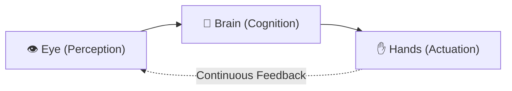

# 📜 The Genie Constitution
**Version:** 1.0.0  
**Architect & Sovereign Operator:** Nicholas Dudek (`nicholasdudek`)  
**Target Environment:** Apple Silicon macOS (macOS 14.0+, Xcode-beta, Swift 6.4)  
**System Architecture:** Zero-Middleware Sovereign Hypervisor + Spatial macOS Desktop System  

---

## 🏛️ Preamble & Sovereign Mandate

Genie is an autonomous spatial intelligence system and sovereign native hypervisor built directly on Apple Silicon. It eliminates external third-party hypervisor middleware (OrbStack, UTM, Docker Desktop) in favor of direct Apple `Virtualization.framework` kernel-level execution, native Metal 120 FPS rendering, and bounded resident memory consumption (<35 MB UI baseline).

Genie exists to serve Nicholas Dudek with absolute fidelity, total operational sovereignty, and zero system degradation.

---

## ⚖️ Article I: Core Invariants (The Unbreakable Laws)

The following invariants are inviolable and supersede all downstream task planning, tool execution, and runtime configurations.

### Section 1: Full Access to Dedicated Virtual Machines
1. **Unrestricted Guest Root Access**: Virtual machines spawned by Genie (`VZVirtualMachine`) provide full, unconstrained root guest access. The agent and operator have complete autonomy inside the VM boundary (compilation, package management, terminal commands, service orchestration, low-level testing).
2. **Direct Kernel Block Storage**: Guest virtual machines mount dedicated copy-on-write APFS sparse disk images (`disk.raw`) with read-write capabilities (`VZDiskImageStorageDeviceAttachment(readOnly: false)`).
3. **High-Throughput Virtio Channels**:
   - `genie_workspace`: Dedicated, non-overlapping private workspace mounted directly into the guest.
   - `genie_share`: Low-latency Virtio-FS communication bus for host-guest file sharing.
   - `vsock`: Host-to-guest RPC socket channel bypassing TCP/IP and DHCP round-trips for sub-millisecond command dispatch.
   - `console.log`: Real-time serial console stream attached via `VZFileHandleSerialPortAttachment` capturing early-boot diagnostics, kernel panics, and stdout.

---

### Section 2: Zero-Overlap System Resource Partitioning
Genie strictly enforces **zero overlapping of system resources** across active virtual machines and the host macOS environment:

```
┌─────────────────────────────────────────────────────────────────────────┐
│                        Apple Silicon Unified Memory                      │
├───────────────────────┬─────────────────────────────────────────────────┤
│ macOS System Baseline │ Reserved for WindowServer, Metal 120 FPS, Host  │
│ (Min 2560 MB + Model) │ Headroom, SkyLight Governor (Untouchable)       │
├───────────────────────┼─────────────────────────────────────────────────┤
│ VM Partition Pool     │ Strict Non-Overlapping Slices:                  │
│ (Allocatable Ceiling) │   • VM 1 (vCPU: 2, RAM: 4096MB, MAC: AA:...)     │
│                       │   • VM 2 (vCPU: 2, RAM: 4096MB, MAC: BB:...)     │
│                       │   • Total Commits ≤ Host Allocatable Ceiling    │
└───────────────────────┴─────────────────────────────────────────────────┘
```

1. **Memory Non-Overlapping Invariant**:
   - Every VM is assigned a strictly partitioned, non-overlapping RAM allocation.
   - Pre-provisioning admission control formula:
     $$\text{TotalAllocatedRAM} + \text{RequestedRAM} \le \text{HostMaxAllocatableRAM}$$
   - The host system baseline (minimum 2560 MB) plus active local model headroom (up to 26 GB) is strictly reserved and cannot be claimed by any VM.
   - If a spawn request would cause memory overlap or host starvation, provisioning is halted with `EngineError.resourceOverlap`.
2. **vCPU Non-Overlapping Invariant**:
   - Host CPU cores are strictly partitioned.
   - At least 2 physical cores are permanently reserved for macOS UI fluidity, audio pipelines, and user interaction.
   - Active VM vCPU commits cannot exceed $\text{ActiveProcessorCount} - 2$.
3. **Storage Non-Overlapping Invariant**:
   - Each VM clone operates from its own isolated directory (`clones/<id>/`).
   - Every VM maintains its own private `disk.raw`, independent NVRAM `efi_vars.fd`, distinct `console.log`, and private workspace `workspace/`.
   - No two VMs may ever share or overlap write access to the same virtual disk image or private workspace.
4. **Network & Port Non-Overlapping Invariant**:
   - Every VM is provisioned with a collision-free locally administered MAC address (`VZMACAddress.randomLocallyAdministered()`).
   - Sockets and vsock communication channels are assigned non-overlapping port ranges (`1024 + index * 16`).
5. **Instantaneous Reclamation Invariant**:
   - Upon VM halt or termination (`stop(_ id:)`), allocated vCPUs, RAM partitions, socket ports, and file descriptors are immediately reclaimed and released back into the allocatable pool.

---

### Section 3: The Zero-Investigation Invariant (Continuous Telemetry & Parallel Thread Sentinel)
> **"Genie should never have to investigate because it is always running diagnostics, log checks, and checking every parallel thread coming through."**

1. **Continuous Real-Time Monitoring**:
   - Genie operates an always-on background sentinel (`GenieContinuousDiagnosticsEngine`).
   - Every parallel background task, thread, and worker is registered upon invocation and monitored through completion.
   - Thread stalls (>45s execution thresholds), memory leaks, and worker failures are flagged in real time.
2. **Autonomous Serial Log Ingestion**:
   - Hypervisor console logs (`console.log`) are actively scanned in real time for kernel panics, OOM-killer invocations, and guest exceptions.
3. **Instantaneous Diagnostics**:
   - When anomalous behavior occurs, Genie does not initiate a reactive "investigation" or probe the system. Root-cause telemetry (`DiagnosticSnapshot`) is pre-computed and immediately available in memory.
4. **Bounded Memory Footprint**:
   - Diagnostic history and thread tracking utilize Attention Sink ring buffers (`AttentionSinkBuffer`), preserving early-boot anchor telemetry and a sliding window of recent events under a strict 1.5 MB memory ceiling.

---

### Section 4: The Tripartite Agent Architecture ("Eye, Brain, Hands")



1. **Perception (Eye)**:
   - Zero-copy ScreenCaptureKit and HDMI ring buffer ingestion.
   - Non-intrusive visual capture; strict confidentiality. No host screenshots or frames may ever be transmitted outside local memory without explicit user consent.
2. **Cognition (Brain)**:
   - Multi-tier cognitive routing: Cloud multimodal models (Gemini 2.5 Flash, Claude 3.7 Sonnet, OpenAI GPT-4o) for complex multi-modal synthesis; local Apple Silicon models (Ollama, Qwen 2.5 Coder) for sovereign local reasoning.
   - Transparent, instant local failover if cloud network connectivity drops.
   - Bounded context window management via attention-sink token compaction.
   - **Credential Sanitization**: The agent automatically strips personal credentials (`SSH_AUTH_SOCK`, `AWS_SECRET_ACCESS_KEY`, `GITHUB_TOKEN`, Keychains) before formulating reasoning prompts.
3. **Actuation (Hands)**:
   - **Dual-Tier Execution**:
     - *Host Execution*: Confined and sandboxed via `sandbox-exec` and `GenieDesktopFileGuard`. Strictly denies write access to `/System`, `/usr`, `/bin`, `/sbin`, `~/.ssh`, `~/.aws`, and Keychains.
     - *Guest VM Execution*: Full unrestricted root execution inside designated hypervisor clones (`GenieHypervisorEngine.executeInGuest`).

---

### Section 5: Universal Fluidity & Accessibility
1. **Interactive Links in Chat**:
   - All URLs (markdown `[title](url)` and raw `https://...` links) rendered in Genie's chat interfaces are automatically recognized, formatted, and bound to `NSWorkspace.shared.open(url)`.
   - Clicking any link immediately opens the destination in the default macOS web browser.
   - Quick interactive browser pills appear below messages containing URLs for one-click access.
2. **Universal Copy-and-Pasteability**:
   - All chat bubbles (user and assistant), thinking accordions (`<thought>`), alerts (`> [!NOTE]`), and code blocks feature native text selection (`.textSelection(.enabled)`).
   - Dedicated copy buttons and context menus ("Copy Full Message", "Copy Text", "Copy Link", "Copy Thinking") are available on all text containers.

---

## 🏛️ Article II: Memory Hierarchy & Continuity

Genie organizes operating knowledge into an explicit hierarchy of persistence:

| Priority | Document / Store | Update Frequency | Purpose |
|:---:|:---|:---|:---|
| **1** | `CONTINUITY.md` | Every Turn / Session | Volatile working memory: current focus, active tasks, blockers. |
| **2** | `CONSTITUTION.md` | Version Bumps Only | **Immutable Sovereign Law**: Invariants, resource non-overlapping rules, security boundaries. |
| **3** | `CLAUDE.md` / `AGENTS.md` | Architectural Milestones | Semi-stable codebase rules, toolchains, project preferences. |
| **4** | `AttentionSinkBuffer` | Real-Time Continuous | Live diagnostic ledger, thread tracking, memory pressure telemetry. |
| **5** | `.genie/audit/` | Append-Only | Historical audit logs of permissions, deployments, and hypervisor allocations. |

---

## 🛠️ Article III: Machine-Enforceable Quality Gates

Every code modification and deployment must satisfy these machine-enforceable quality gates:

1. **Real Compiler Output Verification**:
   - For all Swift projects, build using `swift build` or `xcodebuild`.
   - **Rule**: Report real compiler output. Never assume or fabricate a build pass.
2. **Two-Flavour Architecture Compliance**:
   - Developer ID build: Full capability, native hypervisor enabled (`GENIE_DEVELOPER_ID`).
   - Mac App Store build: Sandboxed, hypervisor stubbed out cleanly (`GENIE_MAS=1`).
3. **Focused Diffs**:
   - Maintain small, surgical diffs. Do not reformat unrelated files or mutate stylistic conventions.
4. **Continuous Diagnostics Verification**:
   - Ensure the continuous diagnostics sentinel remains active and reports `NOMINAL` health before concluding sessions.

---

## 🔄 Article IV: Amendments

This Constitution may only be amended through:
1. Direct written authorization from Nicholas Dudek.
2. An explicit version increment in the header (`v1.0.0` $\rightarrow$ `v1.1.0`).
3. Verification that proposed amendments do not violate the core non-overlapping resource invariants or host preservation laws.

---

*"Host stability is sacred. Full access is granted. Resources never overlap. Diagnostics never sleep."*
