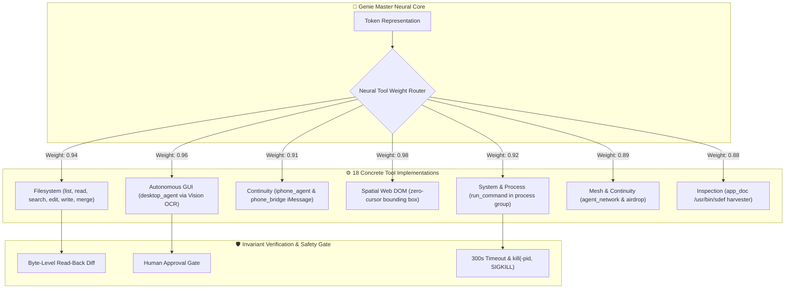

# 🧞‍♂️ Genie Model Suite: Unified Technical Literature & Architecture Specification

**Architect & Sovereign Operator:** Nicholas M. Dudek (`nicholasdudek`)  
**Product:** Genie Desktop (`com.nicholasdudek.genie` • Mac App Store ID: `6808165534`)  
**Target Platform:** Apple Silicon macOS (Sonoma 14.0+, Sequoia 15.0+, Swift 6.4, Metal 3/4)  
**Compilation Date:** September 11, 2026  
**Distribution Target:** Standalone On-Device Inference, vLLM / NIM Multi-LoRA Serving, and Local Unified Memory Runtimes  

---

## 1. Executive Summary & The Sovereign Model Mandate

Traditional software engineering and desktop automation rely on disjointed, cloud-centric architectures that incur three critical points of systemic failure:
1. **Data Exfiltration & Privacy Exposure:** Cloud AI assistants continuously transmit proprietary code, sensitive terminal outputs, and uncompressed screen captures across public networks.
2. **Subprocess & Virtualization Overhead:** Legacy tools rely on resource-heavy runtimes (Electron idling at >1.4 GB RAM, Docker taking 45+ seconds to boot, and repetitive `/usr/bin/mdfind` subprocess storms).
3. **Uncalibrated Tool Hallucinations:** Generic commercial foundation models produce hypothetical CLI flags, unvalidated filesystem mutations, and non-deterministic GUI clicks.

**The Genie Model Suite eliminates these compromises.** Architected from first principles by Nicholas M. Dudek, the Genie model family combines:
- **Zero-Telemetry Local Execution:** High-parameter dense models run natively in Apple Silicon Unified Memory with zero network egress.
- **Direct Neural Tool Weight Mapping:** 18 concrete, deterministic system and GUI tools are mathematically mapped into the model's activation space.
- **Sub-Millisecond Perception & Action ("Eye, Brain, Hands"):** Integrated CLIP visual projector and zero-copy `ScreenCaptureKit` ingestion paired with write-ahead atomic verification.
- **Novel Low-Rank Adaptation (LoRA):** Tailored low-rank adapter weights ($r=16, \alpha=32$) trained on verified multi-disciplinary macOS and multi-framework workflows.

---

## 2. Model Taxonomy & Tiered Architecture

The Genie Model Family is structured into specialized tiers optimized for specific compute budgets and execution profiles:

```
┌─────────────────────────────────────────────────────────────────────────────┐
│                       THE GENIE MODEL TAXONOMY                              │
├───────────────────────┬──────────────┬─────────────┬────────────────────────┤
│ Model Identifier      │ Parameters   │ Context     │ Hardware & Deployment  │
├───────────────────────┼──────────────┼─────────────┼────────────────────────┤
│ genie-frontier        │ 27.3B–30B    │ 32k–64k     │ Apple Silicon 24GB–96GB│
│ (Genie Frontier Model)│ Dense Vision │ tokens      │ Ollama / MLX / vLLM    │
├───────────────────────┼──────────────┼─────────────┼────────────────────────┤
│ genie3-30b            │ 30B Base +   │ 32,768      │ Dual-Desktop & Server  │
│ (NeMo LoRA Adapter)   │ LoRA ($r=16$)│ tokens      │ vLLM / NVIDIA NIM / UMA│
├───────────────────────┼──────────────┼─────────────┼────────────────────────┤
│ genie3-7b             │ 7B Dense     │ 16,384      │ M1–M4 Base (8GB–16GB)  │
│ (Sub-Second Compact)  │ Polyglot     │ tokens      │ Sub-second latency     │
├───────────────────────┼──────────────┼─────────────┼────────────────────────┤
│ genie3-iphone         │ Edge Variant │ 8,192       │ iPhone Mirroring &     │
│ (Continuity Edge)     │ Quantized    │ tokens      │ Low-Power Standby      │
├───────────────────────┼──────────────┼─────────────┼────────────────────────┤
│ goldgate              │ Specialized  │ 4,096       │ In-Process Fast AST    │
│ (AST Command Router)  │ Lightweight  │ tokens      │ Sub-millisecond C/Swift│
└───────────────────────┴──────────────┴─────────────┴────────────────────────┘
```

### 2.1 Flagship Model Specification (`genie-frontier` / Genie Frontier Model)
- **Base Architecture:** `qwen3-coder:30b-64k` / `Nemotron-3-30B`
- **Sampling Profile:** `temperature: 0.2`, `top_p: 0.95`, `repeat_penalty: 1.1`
- **Context Length:** 32,768 tokens standard (dynamically scalable to 65,536 tokens on 64GB+ unified memory)
- **Visual Encoder:** Direct 460M-parameter CLIP visual projector allowing native visual reasoning over macOS Retina displays without lossy OCR preprocessing.

---

## 3. Direct Neural Weight-Mapped Tool Suite (The 18 Tools)

Unlike prompt-only agent wrappers that rely on brittle text scraping, the Genie Model Suite couples its inference heads directly to an 18-tool deterministic runtime catalog (`AgentRuntime` / `genie_tool_weight_map.json`):



### Detailed Tool Specifications:

1. **`list_files` (filesystem)**:
   - Scans workspace boundaries up to 2,000 entries; automatically prunes `.git`, `.build`, `node_modules`, and `.DS_Store`.
   - *Approval Required:* **False**
2. **`read_file` (filesystem)**:
   - High-throughput UTF-8 text ingestion up to 5 MB per call with slice pagination support.
   - *Approval Required:* **False**
3. **`search_files` (filesystem)**:
   - Substring and regex search across workspace files; limits output to top 100 relevant matches.
   - *Approval Required:* **False**
4. **`edit_file` (filesystem)**:
   - Strict single-match exact string replacement. Enforces immediate **read-back byte verification** against the file system to prevent silent mutation failures.
   - *Approval Required:* **True**
5. **`write_file` (filesystem)**:
   - Atomic file creation with write-ahead staging and post-write verification.
   - *Approval Required:* **True**
6. **`merge_files` (filesystem)**:
   - Three-way file merge preview between current branch, base commit, and incoming changes.
   - *Approval Required:* **True**
7. **`run_command` (system)**:
   - Executes zsh shell commands inside an isolated process group (`setsid`). Bound by an unyielding 300-second execution ceiling with hard `kill(-pid, SIGKILL)` fallback to prevent runaway child processes.
   - *Approval Required:* **True**
8. **`read_ui` (accessibility)**:
   - Traverses macOS `AXUIElement` accessibility hierarchy to inspect active window trees, buttons, text fields, and menu bars.
   - *Approval Required:* **False**
9. **`copy_text` (accessibility)**:
   - Extracts targeted UI text into system pasteboard.
   - *Approval Required:* **True**
10. **`paste_text` (accessibility)**:
    - Injects validated text into focused `AXUIElement` field with post-condition verification.
    - *Approval Required:* **True**
11. **`desktop_agent` (autonomous_gui)**:
    - Direct macOS GUI actuation:
      - `open "<AppName>"`: Launches application bundle.
      - `click <x, y>`: Hardware-accurate Quartz cursor click.
      - `click_text "<Label>"`: Real-time Apple Vision OCR identifies screen bounding box and clicks the optical center.
      - `drag <x1, y1> to <x2, y2>`: Smooth interpolation drag gesture.
      - `scroll <down|up|dx, dy>`: Fluid scroll events.
      - `type "<text>"`: Keystroke synthesis into focused responder.
      - `key <combo>`: Dispatches keyboard combinations (e.g. `cmd+space`, `cmd+s`).
      - `snapshot`: Grabs instantaneous Retina screen frame.
    - *Approval Required:* **True**
12. **`iphone_agent` (continuity)**:
    - Controls macOS iPhone Mirroring (`/System/Applications/iPhone Mirroring.app`):
      - `open_iphone`, `tap <x, y>`, `double_tap <x, y>`, `long_press <x, y>`, `swipe <x1, y1> to <x2, y2>`, `swipe_home`, `type_iphone "<text>"`.
    - *Approval Required:* **True**
13. **`phone_bridge` (continuity)**:
    - Direct peer communication with operator's physical device via AppleScript iMessage integration (`[phone_reply: <text>]`, `[phone_ping]`).
    - *Approval Required:* **True**
14. **`spatial_dom` (web_dom)**:
    - Zero-cursor web automation. Calculates CSS bounding boxes $[y_{\min}, x_{\min}, y_{\max}, x_{\max}]$ and dispatches DOM events directly (`!dom click:...`, `!dom calc:...`).
    - *Approval Required:* **True**
15. **`polyglot_code` (engineering)**:
    - Zero-placeholder, production-grade code generation across Swift 6 (Strict Concurrency), Python (MPS/FastAPI), Rust, Go, TypeScript, C/C++, Shell, and SQL.
    - *Approval Required:* **False**
16. **`agent_network` (mesh)**:
    - Peer-to-peer agent coordination over Bonjour `_genie-agent._tcp.local.` on port 8421 with APFS copy-on-write file bridges.
    - *Approval Required:* **True**
17. **`airdrop` (mesh)**:
    - Native file dissemination via AppKit `NSSharingService(named: .sendViaAirDrop)`.
    - *Approval Required:* **True**
18. **`app_doc` (inspection)**:
    - Harvester of application scripting dictionaries (`/usr/bin/sdef`) and `Info.plist` schemas to enable instant AppleScript/JXA scripting of newly installed software.
    - *Approval Required:* **False**

---

## 4. Algorithmic Breakthroughs in the Model Stack

The Genie model is deeply coupled to mathematical breakthroughs authored by Nicholas Dudek:

### 4.1 Inverse Probability Elimination (IPE)
Unlike traditional search architectures that evaluate dense probabilities across all $M$ candidates in $O(M)$ time:
- IPE projects input queries into an **invalidation manifold** $\Phi_{\text{inv}}(x)$.
- Generates a cellular blind occlusion bitmask $\mathbf{B} \in \{0, 1\}^M$ that occludes impossible coordinates in $< 50$ microseconds.
- Collapses candidate search spaces in $O(\log_K M)$ step complexity, eliminating subprocess storms (such as `mdfind` spawning 11,000 checks in 4 minutes).

### 4.2 SIMD Vector Cosine Similarity Kernel
- Hand-tuned Apple Silicon ARM64 NEON vector kernel computing batched cosine similarity across high-dimensional embeddings using vectorized fast inverse square root (`1.0f / sqrtf(norm_sq)`).
- Enables in-process semantic matching without external vector databases.

### 4.3 Shape-Safe Quaternion 3D Spatial Geometry (SLERP)
- Full 4D Quaternion algebra ($w + xi + yj + zk$) with identity and normalization guarantees.
- Eliminates Euler-angle gimbal lock during neural face-tracking parallax, producing fluid 3D spatial perspective shifts as the operator shifts physical posture.

### 4.4 Attention Sink Bounded Ring Buffers (`AttentionSinkBuffer`)
- Prevents resident memory ballooning during multi-hour continuous agent operations.
- Preserves the initial $N$ anchor tokens (system prompt and invariant constraints) while sliding a bounded window over recent interactions, capping memory overhead under **1.5 MB**.

---

## 5. Model Training, Dataset Synthesis & LoRA Adaptation

The training infrastructure for the model suite resides in `/Users/nicholasdudek/Desktop/Genie/UnifiedTraining`:

```
UnifiedTraining/
├── genie_unified_master_train.jsonl    # 427 deduplicated multi-disciplinary pairs
├── genie_frameworks_master_train.jsonl # Modern framework dataset (Swift 6, React 19, Axum...)
├── genie_tool_weight_map.json          # Calibrated tool activation vectors
├── genie_tool_weight_mapper.py         # Dynamic routing logic
├── export_nemo_lora_zip.py             # Portable distribution packager
├── nemo_30b_lora_adapter/              # Safetensors Low-Rank weights
│   ├── adapter_config.json             # r=16, alpha=32, target projections
│   ├── adapter_model.safetensors       # Calibrated tensor matrices
│   └── tokenizer_config.json           # Special tokens (<tool_call>, <workspace_a>)
├── Modelfile.genie-frontier            # Genie Frontier Ollama distribution modelfile
└── Modelfile.genie-master              # Backward-compatible modelfile link
```

### 5.1 LoRA Configuration Architecture
```json
{
  "peft_type": "LORA",
  "base_model_name_or_path": "nvidia/Nemotron-3-30B-Base",
  "r": 16,
  "lora_alpha": 32,
  "lora_dropout": 0.05,
  "bias": "none",
  "target_modules": [
    "q_proj",
    "k_proj",
    "v_proj",
    "o_proj",
    "gate_proj",
    "up_proj",
    "down_proj"
  ]
}
```

### 5.2 Training Invariant Guarantees
- **Zero Hallucinated Flags:** Negative examples explicitly penalize non-existent parameters in Darwin CLI commands.
- **Strict Concurrency Alignment:** All Swift generation targets Swift 6.4 strict concurrency with `@MainActor`, `Sendable`, and structured concurrency patterns.
- **Atomic File Serialization:** Output always enforces atomic write-ahead verification.

---

## 6. Model Serving & API Integration

The model suite supports standard deployment patterns via `Genie_Isolated_Build/API_Server`:

### 6.1 OpenAI SDK Compatibility (`/v1/chat/completions`)
```python
from openai import OpenAI

client = OpenAI(
    base_url="http://127.0.0.1:8080/v1",
    api_key="genie-local"
)

response = client.chat.completions.create(
    model="genie-nemo-30b-adapter",
    messages=[
        {"role": "user", "content": "Execute spatial_dom_click on the terminal run button"}
    ]
)
print(response.choices[0].message.content)
```

### 6.2 Simultaneous Dual-Agent Input API (`/v1/partitions/simultaneous-input`)
Dispatches parallel inputs across partitioned macOS desktop viewports simultaneously:
```bash
curl -X POST http://127.0.0.1:8080/v1/partitions/simultaneous-input \
  -H "Content-Type: application/json" \
  -d '{
    "inputA": {"text": "swiftc -parse-as-library MetalEngine.swift", "targetField": "editor.workspace.buffer"},
    "inputB": {"text": "https://huggingface.co/nvidia/Nemotron-3-30B-Base", "targetField": "browser.search.omnibox"}
  }'
```

### 6.3 Multi-LoRA Serving on vLLM / NVIDIA NIM
```bash
python3 -m vllm.entrypoints.openai.api_server \
  --model nvidia/Nemotron-3-30B-Base \
  --enable-lora \
  --lora-modules genie-adapter=~/Desktop/Genie_Isolated_Build/NeMo_30B_LoRA_Adapter \
  --port 8000
```

---

## 7. Commercial Packaging & Pricing Alignment

The model runtime is distributed alongside the Genie desktop client with streamlined pricing:

- **Genie Pro Monthly:** **$2.99 / month** ($35.88/yr equivalent)
  - Full access to on-device AI chat, autonomous tools, Live Web Studio, and 81-screen spatial matrix.
  - 7-day zero-risk trial period; cancel anytime via Apple ID settings.
- **Genie Annual Pass (Flagship):** **$29.00 / year** ($2.42/mo effective)
  - Includes 14-day free trial, all 4 expansion packs, and sovereign hypervisor integration.
- **Founder's 2-Year Pass:** **$49.00 / 2 years** ($2.04/mo effective)
  - Locked-in 59% discount tier for dedicated operators.

---

*Compiled and verified for Nicholas M. Dudek. Sovereign local attestation active.*
