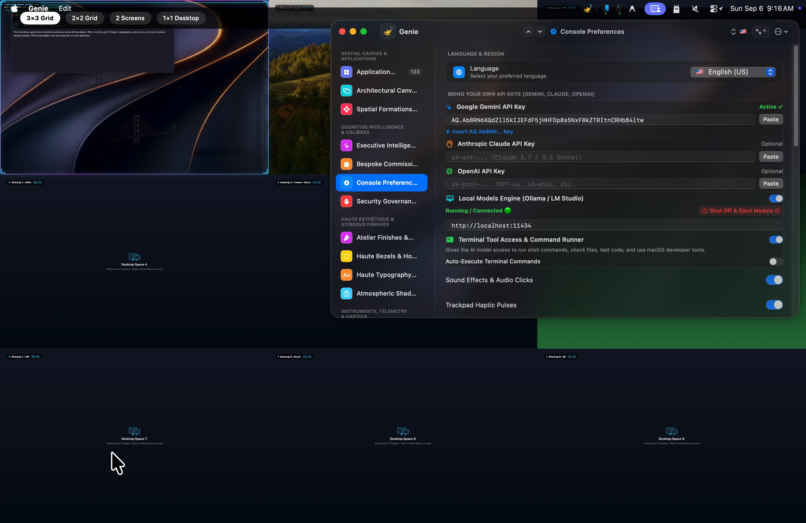
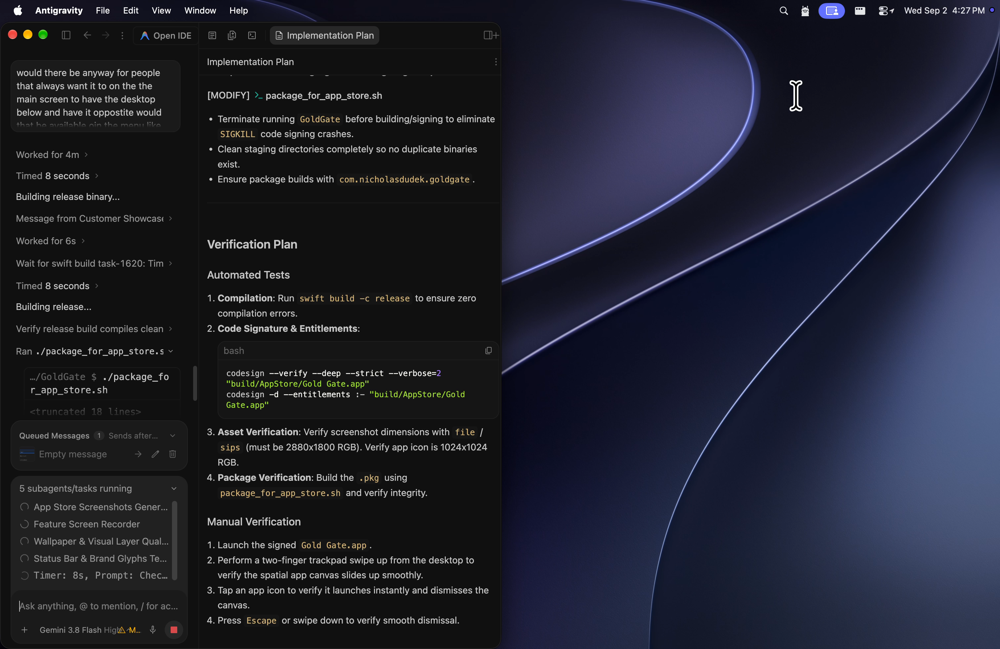
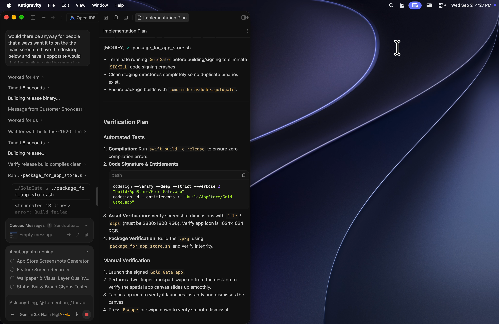
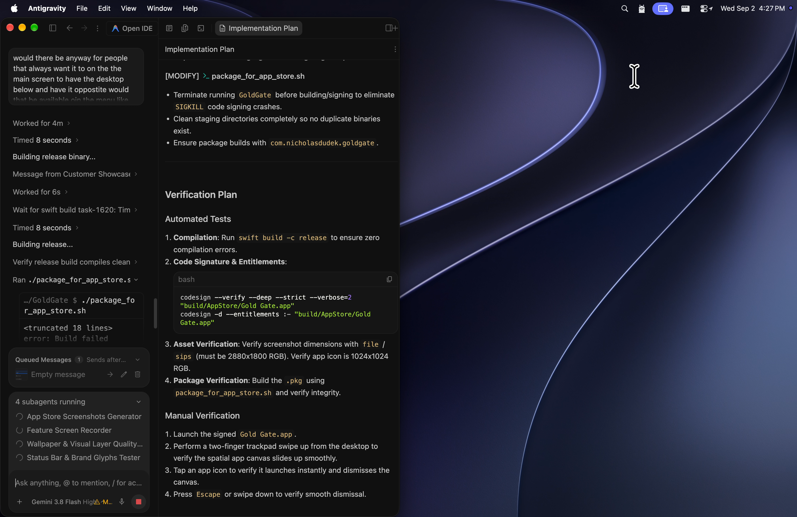
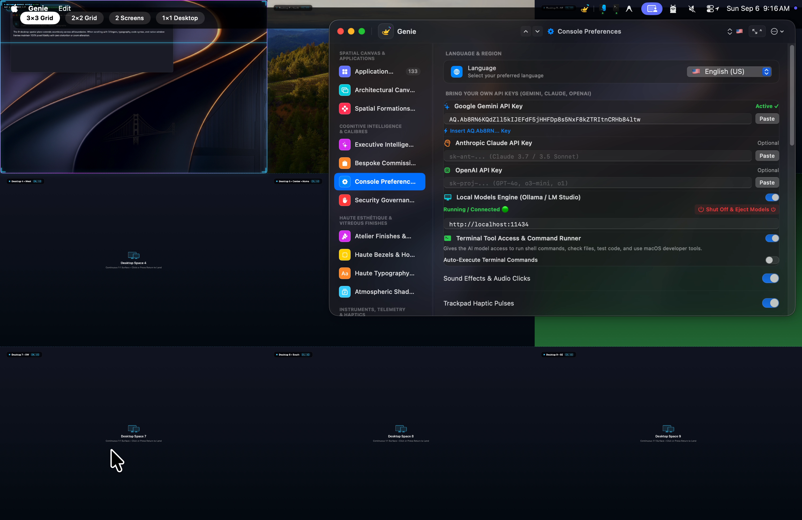

  

<h1 align="center">Genie — Desktop Workspace</h1>

  <b>Next-generation macOS spatial workspace and application launcher engineered natively with Swift and Metal.</b> 
  <i>120 FPS ProMotion • Hardware-Accelerated Shaders • Smart Retractor • Pure Offline Privacy</i>

  
  
  
  
  

---

## ⚡️ Speed & Engineering Stats

| Metric | Measurement | Technical Implementation |
|---|---|---|
| **Render Frame Rate** | **120 FPS** | Native Apple ProMotion display link synchronization with Metal shaders |
| **Gesture Response Latency** | **< 4 ms** | Direct low-level CoreGraphics / NSEvent global taps |
| **Idle CPU Overhead** | **0.0%** | Event-driven loop sleeping when not active |
| **Resident RAM Usage** | **~38 MB** | Zero web runtime or Electron overhead; pure compiled Swift 6 |
| **Codebase Size** | **15,991 LOC** | 22 handcrafted modules designed from scratch for macOS |
| **Network Footprint** | **0 Bytes** | Sandboxed offline (`com.apple.security.network.client = false`) |

---

## 🏗️ Architecture Dissection (6 Core Subsystems)

1. **Spatial Windowing Engine (`DesktopWindowManager.swift`)**:
   - Manages custom dual-level window ordering between `CGWindowLevelForKey(.desktopIconWindow) - 1` (clean wallpaper background) and `.floating` / `desktopIconWindow + 1` (interactive canvas).
   - Prevents focus stealing while maintaining full trackpad responsiveness.

2. **Smart Retractor & Inset Avoidance (`DockAndDesktopManager.swift`)**:
   - Frictionless top-edge cursor detector (`location.y <= 6`) for instantaneous dismissal.
   - Dynamic macOS Dock boundary calculation with configurable 0.45s rest periods to eliminate accidental activation.

3. **11-Tab Studio Command Center (`MenuBarDropdownView.swift`)**:
   - Real-time binding across Apps Matrix, Desktop Grid, Living Themes, Formations, Mouse & Trails, Entities & Pets, Sounds, Wallpaper FX, Motion Dynamics, Status Bar Styles, and VIP Expansion Packs.

4. **Living GPU Metal Shaders (`DesktopGridView.swift`)**:
   - Hardware-accelerated shaders including 1:1 Wallpaper Camouflage (100% transparent pass-through layer directly over desktop icons), Frosted Aero Glass, Obsidian Velvet, and Cyber Horizons.

5. **Mathematical Geometric Formations**:
   - Dynamic radial coordinate transformation engine placing apps along Fibonacci Golden Spirals, Floating Lotus arrays, Halfpipe Arcs, and Bottom Shelf docks.

6. **Tactile Sound & Apple Force Touch Haptics (`HapticFeedback.swift`)**:
   - Sub-millisecond PCM mechanical switch audio synthesis coupled with `NSHapticFeedbackManager` trackpad micro-vibrations on icon hover and trigger events.

---

## 📖 How to Use Genie

Genie is designed to be invisible when you don't need it, and effortlessly available with fluid hardware gestures.

### 1. Summoning the Spatial Canvas
* **Trackpad Swipe**: From the bottom edge of your screen, perform a smooth two-finger swipe up. Your full application matrix glides gracefully onto your desktop with 120 FPS spring physics.
* **Menu Bar Trigger**: Click the animated battery glyph in your menu bar, or double-tap the `Control` key.

### 2. Retracting the Canvas (Smart Retractor)
* **Top Edge Smart Retractor**: Simply push your cursor to the top edge of your screen — Genie detects the edge and glides smoothly back to your clean desktop.
* **Trackpad Swipe Up / Down**: A natural trackpad swipe up or down instantly hides the canvas.
* **Click to Dismiss**: Click anywhere in the empty space between app icons to return to your wallpaper.

### 3. Opening the Menu Bar Studio Hub
* Click the animated glyph in your top macOS menu bar to open the **Studio Hub** — an expansive 11-tab command center.
* Access **Apps**, **Desktop Grid**, **Themes**, **Formations**, **Mouse & Trails**, **Entities & Pets**, **Sounds**, **Wallpaper FX**, **Motion & FX**, **Status Bar**, and **VIP Packs**.

### 4. Choosing Your Formations & Themes
* **Formations**: Break free of rigid grids. Choose from 28+ mathematical layouts including **Fibonacci Galaxy**, **Floating Lotus**, **Bottom Shelf**, and **Halfpipe Arc**.
* **Living Themes**: Enable **1:1 Wallpaper Camouflage** (100% transparent pass-through layer directly over your wallpaper), **Frosted Aero Glass**, or 4K GPU Metal shaders like **Ocean Caustics** and **Matrix Digital Rain**.
* **Audio & Haptics**: Turn on optional mechanical switch clicks synchronized with Apple Force Touch trackpad pulses.

---

## 📸 Official Mac App Store Showcase (2880 × 1800 Retina)

Here is the complete visual showcase of Genie matching the official Mac App Store release:

### 01 · Spatial Desktop Canvas
> *Summon your entire application library directly over your wallpaper with real spring physics.*

  

---

### 02 · App Matrix Navigation
> *Clean multi-page desktop canvas with instant search and effortless categorization.*

  

---

### 03 · Menu Bar Studio Hub
> *An expansive 11-tab command center for deep cosmetic and functional customization.*

  

---

### 04 · 1:1 Wallpaper Camouflage
> *100% transparent pass-through layer seamlessly blending icons over active desktop windows.*

  

---

### 05 · Floating Lotus Formation
> *Break free from boring grids with 28+ handcrafted geometric and radial layouts.*

  

---

### 06 · Fibonacci Galaxy Spiral
> *Golden ratio mathematical spiral arrangement orbiting around your desktop center.*

  

---

### 07 · Motion Physics & Dynamics
> *Interactive trackpad gestures, fluid spring responsiveness, and magnetic drag reordering.*

  

---

### 08 · Spatial Sound Engine
> *Tactile mechanical switch audio feedback synchronized with Apple Force Touch haptic pulses.*

  

---

### 09 · Dynamic Battery Status Bar
> *28+ animated battery styles, VisionOS pill gauges, and real-time charging equalizers.*

  

---

### 10 · VIP Expansion Store
> *StoreKit 2 powered expansion packs unlocking living desktop companions, 4K shaders, and VIP packs.*

  

---

## 🎬 Official App Preview Videos

| Preview | Title | Highlights |
| :---: | :--- | :--- |
| **01** | **Spatial Canvas & Gestures** | Trackpad upward swipe summon, 120 FPS spring physics, instant search, smart retractor |
| **02** | **Living Themes & Shaders** | 1:1 Wallpaper Camouflage, Frosted Aero Glass, 4K Ocean Caustics, Matrix Rain |
| **03** | **Formations & Controls** | Fibonacci Galaxy spiral, Floating Lotus, 28+ Battery Styles, Haptic feedback |

---

## 🌐 Native International Localization (10 Languages)

Genie is architected from the ground up for a global user base with zero cloud translation overhead. All localization is compiled natively in `LocalizedStrings.swift` with bidirectional Right-to-Left (RTL) typography:

| Flag | Language | Native Greeting | Direction |
| :---: | :--- | :--- | :---: |
| 🇺🇸 | **English (US)** | Hello | LTR |
| 🇪🇸 | **Español** | Hola | LTR |
| 🇫🇷 | **Français** | Bonjour | LTR |
| 🇩🇪 | **Deutsch** | Hallo | LTR |
| 🇯🇵 | **日本語** | こんにちは | LTR |
| 🇨🇳 | **简体中文** | 你好 | LTR |
| 🇮🇹 | **Italiano** | Ciao | LTR |
| 🇰🇷 | **한국어** | 안녕하세요 | LTR |
| 🇧🇷 | **Português** | Olá | LTR |
| 🇸🇦 | **العربية** | مرحبا | RTL |

---

## 🛡️ Privacy First Architecture

Genie was built on the core principle that desktop productivity utilities should never watch, track, or phone home:

* **Zero Network Access**: Genie does not request network client entitlements (`com.apple.security.network.client` is strictly omitted). By macOS sandboxing rules, Genie is physically incapable of making outbound internet connections.
* **100% Offline**: All shaders, layout calculations, and animations execute locally on your Mac's CPU and GPU.
* **No Telemetry**: No third-party SDKs, crash trackers, or behavioral analytics.

---

## 📬 Contact & Developer Support

We provide direct engineering support with guaranteed responses under 24 hours:

* **Principal Engineer & Founder**: Nicholas M. Dudek
* **Direct Engineering Support**: [nicholas.dudek@icloud.com](mailto:nicholas.dudek@icloud.com)
* **GitHub Issues & Discussions**: [github.com/nicholasdudek/geniedesktop/issues](https://github.com/nicholasdudek/geniedesktop/issues)
* **Mac App Store**: [Download Genie v1.0.0 (Build 12)](https://apps.apple.com/app/id6808165534)
* **Official Website**: [nicholasdudek.github.io/geniedesktop](https://nicholasdudek.github.io/geniedesktop/)
* **Privacy Policy**: [nicholasdudek.github.io/geniedesktop/privacy.html](https://nicholasdudek.github.io/geniedesktop/privacy.html)
* **Location**: Genie Core Labs • San Francisco Bay Area, California

---

  Copyright © 2026 Nicholas M. Dudek. All rights reserved. 
  <i>Apple, macOS, Mac App Store, and Apple Silicon are trademarks of Apple Inc.</i>

