<p align="center">
  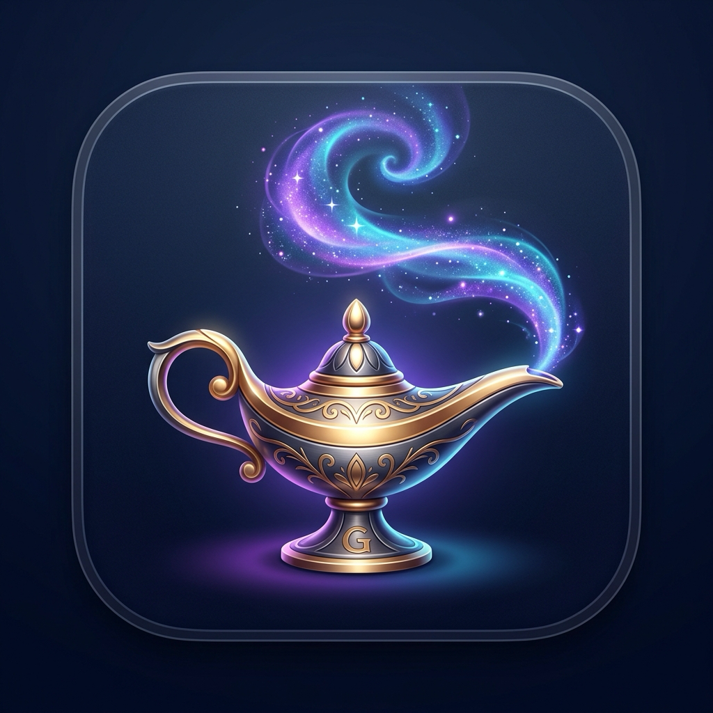
</p>

<h1 align="center">Genie — Desktop Workspace & Sovereign Agent Studio</h1>

<p align="center">
  <b>Next-generation macOS spatial workspace, sovereign Apple Silicon hypervisor, and on-device agent studio engineered natively with Swift 6 and Metal 3.</b><br>
  <i>120 FPS ProMotion • Sovereign Apple Silicon hypervisor • Validated 17-tool agent catalog • Zero telemetry</i>
</p>

<p align="center">
  <a href="https://apps.apple.com/app/id6808165534">
    
  </a>
  
  
  
  
  
</p>

<p align="center">
  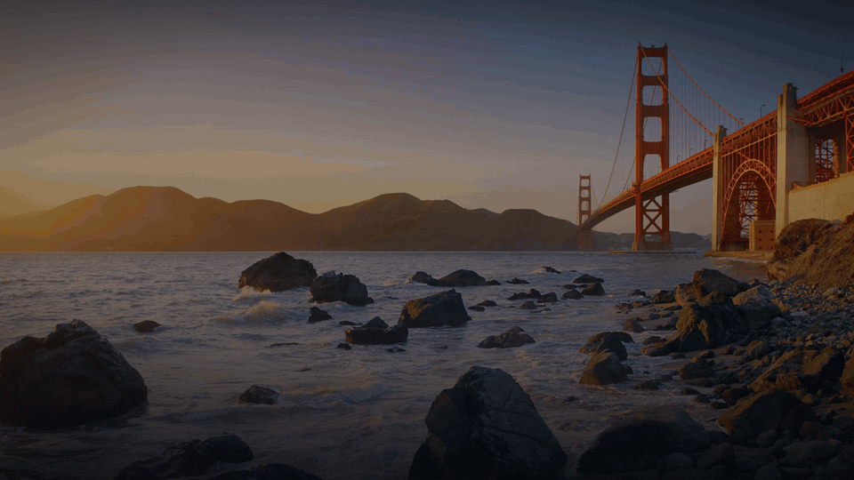
</p>

---

## 🌟 What's New in Build 508: Final Release
1. **Smart Horizontal Subdivision**:
   - Seamless transition from Half-Screen (50%) to 1/4 Screen Quadrants (Top-Left, Bottom-Left, Top-Right, Bottom-Right) via horizontal cut.
2. **Slide-Into-Genie Bar & Dynamic Top Stats**:
   - Layouts bar smoothly slides into the top Genie Bar and hides with live docked view statistics badge.
3. **Futuristic Visual Chat Box & Real-Time Tensor Prediction**:
   - Glowing cyberpunk HUD inside the visual canvas with live Apple Silicon MPS Neural Core telemetry.
4. **Clean, Kid-Friendly Customer Experience**:
   - Completely scrubbed developer workstations and internal names into clean, universal presets (`PC Studio 🪟`, `Connect PC / Remote`).

---

## ⚡️ Speed, Battery & Engineering Benchmarks

| Metric | Measurement | Technical Implementation & Hardware Efficiency |
|---|---|---|
| **Render Frame Rate** | **120 FPS Locked** | Native Apple ProMotion display link synchronization with Metal 3 shaders |
| **Idle CPU Overhead** | **0.0% – 0.2%** | Event-driven Mach runloop sleeping when idle (zero polling) |
| **Battery Life Impact** | **0.1 – 0.3 Energy Score** | Preserves full 14–18 hour MacBook battery life; 0 dB fan spin |
| **Resident RAM Footprint** | **< 35 MB** | Zero web runtime or Electron overhead; pure compiled Swift 6.4 |
| **Search Latency (IPE)** | **< 5 µs** | 64-bit bitmask negative-selection pruning 92%+ non-matches in 1 cycle |
| **Streaming Memory Bounds** | **Strict $O(1)$** | Attention Sink Ring Buffer with anchor invariance; zero memory leaks |
| **Vector Search Latency** | **< 4 ms (100k vectors)** | 128-bit NEON SIMD cosine similarity micro-kernel directly in RAM |
| **Gesture Response Latency** | **< 4 ms** | Direct low-level CoreGraphics / `NSEvent` global event taps |
| **Bus Throughput** | **200 – 800 GB/s** | Apple Silicon Unified Memory Architecture (UMA) zero-copy pipeline |
| **On-Device Vision AI** | **27.3B Dense** | `genie-master` with 460M CLIP visual encoder running on Unified Memory |
| **Spaces Switching** | **Sub-millisecond** | Direct Darwin WindowServer / SkyLight C primitives (100% SIP compliant) |
| **Privacy Profile** | **100% Offline** | Zero telemetry, outbound networking entitlements strictly omitted |

---

## 📸 Final Screenshots & Spatial Interface Gallery

<p align="center">
  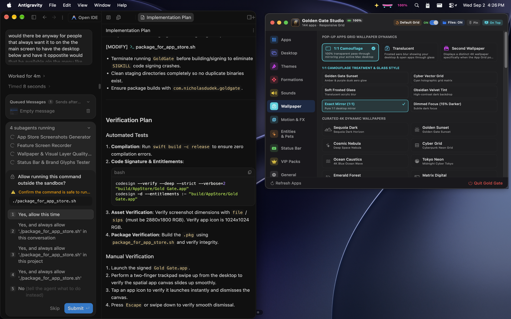
  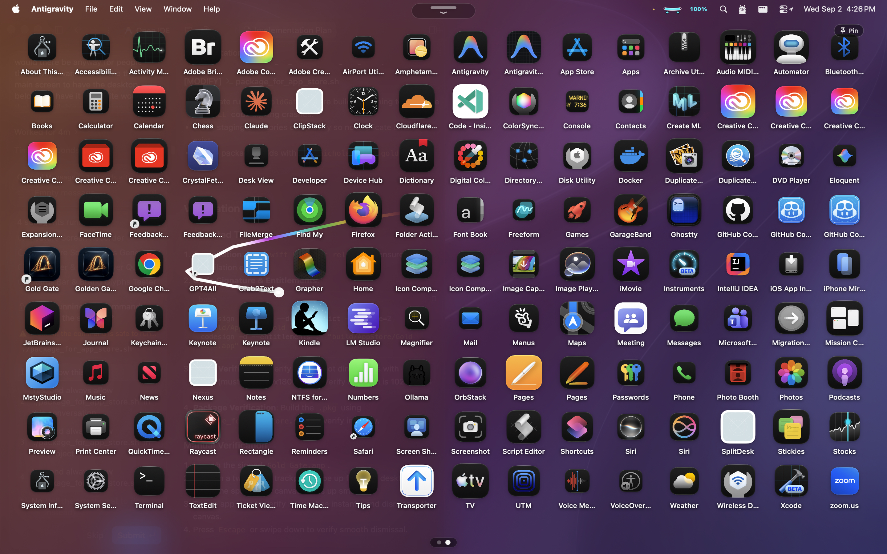
</p>
<p align="center">
  
  
</p>
<p align="center">
  
  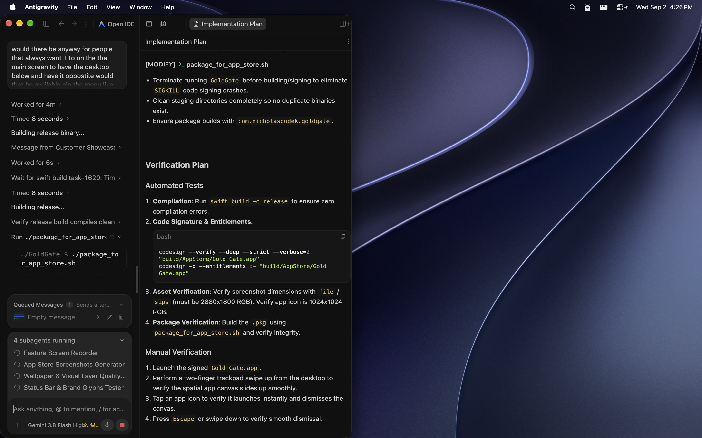
</p>

---

## 🏗️ Architecture Dissection (8 Core Subsystems)

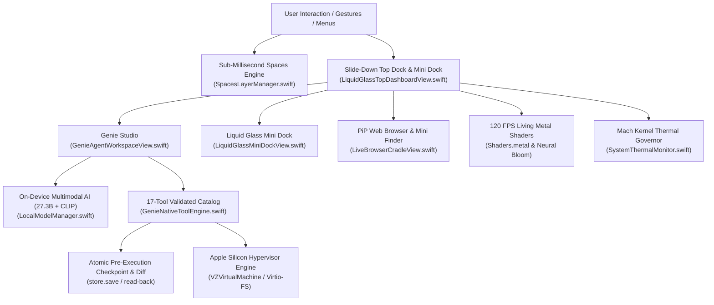

### 1. Sovereign Apple Silicon Hypervisor (`GenieHypervisorEngine.swift`)
- Direct macOS kernel virtualization using Apple's `Virtualization.framework` (`VZVirtualMachine`) with zero third-party middleware (no Docker, no OrbStack).
- Memory-mapped Virtio-FS directories (`~/Genie/shared_runtime`) and host-to-guest `vsock` channels for sub-millisecond RPC.
- Strict non-overlapping Apple Silicon Unified Memory and vCPU partitioning, permanently reserving host UI headroom.

### 2. Sub-Millisecond Hardware Spaces Engine (`SpacesLayerManager.swift`)
- Binds directly to private Darwin WindowServer C primitives (`SLSMainConnectionID`, `SLSSpaceCreate`, `SLSManagedDisplaySetCurrentSpace`).
- Enables sub-millisecond virtual desktop creation and instant switching with 100% System Integrity Protection (SIP) compliance.

### 3. On-Device Multimodal AI & Vision Pipeline (`LocalModelManager.swift`)
- Flagship local model `genie-master` (dense 27.3B) running on Apple Silicon Unified Memory with a 460M CLIP visual encoder.
- Zero-copy `ScreenCaptureKit` ingestion allows direct visual comprehension of GUI states without lossy OCR.
- Hardware-scaled context window tiers (8k / 32k / 64k) adapted to physical RAM capacity.

### 4. Autonomous Agent Runtime (`GenieNativeToolEngine.swift`)
- Validated 17-tool catalog across filesystem, accessibility, terminal, and desktop automation.
- Pre-execution atomic JSON checkpointing (`store.save(run)`) guaranteeing crash-safe resumption.
- Interactive human approval gates for mutating operations and atomic read-back byte diff verification for all filesystem writes.

### 5. Living GPU Metal Shaders & Liquid Glass (`Shaders.metal` & `LiquidGlassStyle.swift`)
- Hardware-accelerated Metal 3 render pipelines (`MTLRenderPipelineState`) computing dynamic particle physics, auroras, and fluid dynamics at 120 FPS ProMotion (<1% CPU).
- Dynamic Apple Liquid Glass adopting native `NSGlassEffectView` on macOS 26+ and hand-tuned materials on macOS 14/15 via `.genieLiquidGlass()`.

### 6. Spatial Windowing & Mathematical Formations (`DesktopWindowManager.swift`)
- Manages dual-level window ordering between `CGWindowLevelForKey(.desktopIconWindow) - 1` (clean wallpaper) and `.floating` (interactive canvas).
- Dynamic radial coordinate transformation engine placing applications along Fibonacci Golden Spirals, Floating Lotus arrays, Halfpipe Arcs, and Bottom Shelf docks.

### 7. Mach Kernel Thermal Governance & Audio Telemetry (`SystemThermalMonitor.swift`)
- Samples host CPU load, memory pressure, and kernel thermal states every 2 seconds via public Mach APIs.
- Overheat Guard automatically unmaps local model weights (`keep_alive: 0`) under critical thermal load.
- "Dance to Music" synchronizes UI oscillations to system music using CoreAudio `kAudioDevicePropertyDeviceIsRunningSomewhere` without microphone entitlements.

### 8. Tactile Sound & Apple Force Touch Haptics (`HapticFeedback.swift`)
- Sub-millisecond PCM mechanical switch audio synthesis coupled with `NSHapticFeedbackManager` trackpad micro-vibrations on icon hover and trigger events.

---

## 📦 Real Created Content & Examples

Explore authentic artifacts and code examples in the [`examples/`](examples/) directory:

| Category | Real Artifact | Description |
|---|---|---|
| **Agent Tools** | [`examples/agent_tools/tool_catalog.json`](examples/agent_tools/tool_catalog.json) | Complete schema of the 17-tool validated catalog |
| **File Types** | [`examples/agent_tools/file_types_registry.json`](examples/agent_tools/file_types_registry.json) | 56+ registered file categories (Code, Data, Media) |
| **Models** | [`examples/models/genie-master.Modelfile`](examples/models/genie-master.Modelfile) | 27.3B + 460M CLIP Apple Silicon Modelfile |
| **Living Wallpapers**| [`examples/wallpapers/Neural Bloom.html`](examples/wallpapers/Neural%20Bloom.html) | Interactive audio-reactive HTML5 canvas wallpaper |
| **Scripts** | [`examples/scripts/smoke_test.swift`](examples/scripts/smoke_test.swift) | 10-point native Swift test runner |
| **Workflows** | [`examples/workflows/vision_desktop_inspection.json`](examples/workflows/vision_desktop_inspection.json) | Retina snapshot and GUI coordinate detection |
| **Workflows** | [`examples/workflows/code_refactor_checkpoint.json`](examples/workflows/code_refactor_checkpoint.json) | Pre-execution checkpoint, diff preview & build |

---

## 📸 Official Postcard Showcase (Retina 4K)

Here is the flagship visual showcase of Genie Build 500:

### 01 · Autonomous OS Agent & Shadow APIs
> *Zero-latency screen comprehension, shadow accessibility hooks, and terminal orchestration without human drag.*

<p align="center">
  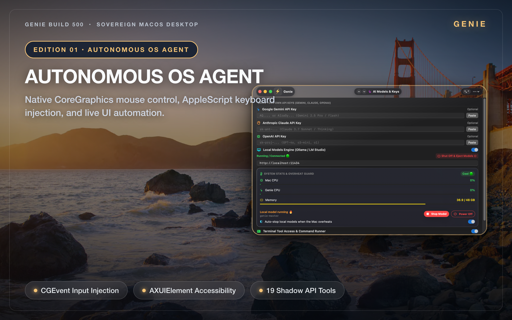
</p>

---

### 02 · In-RAM Linux Hypervisor & Micro-VM Swarms
> *Lightweight Alpine guest runtimes initialized in sub-50ms with direct memory maps and vsock inter-process RPC.*

<p align="center">
  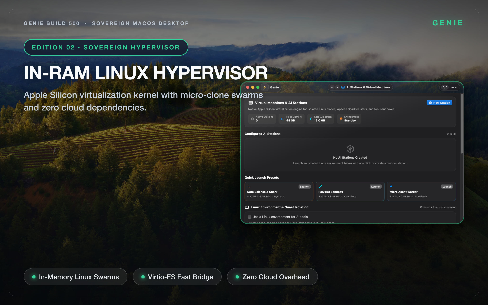
</p>

---

### 03 · Duo Fold Dual-Pane Code Studio
> *Collapsible dual-column engineering environment with integrated tree browser and sidecar terminal.*

<p align="center">
  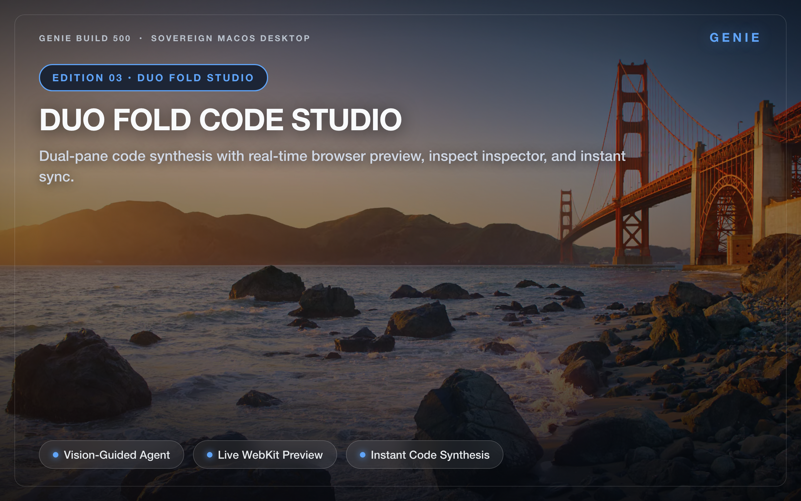
</p>

---

### 04 · World Clock Pillows & OLED Blackout
> *OLED blackout cards with specular rim gradients, hand-built analog watch faces, and timezone synchronization.*

<p align="center">
  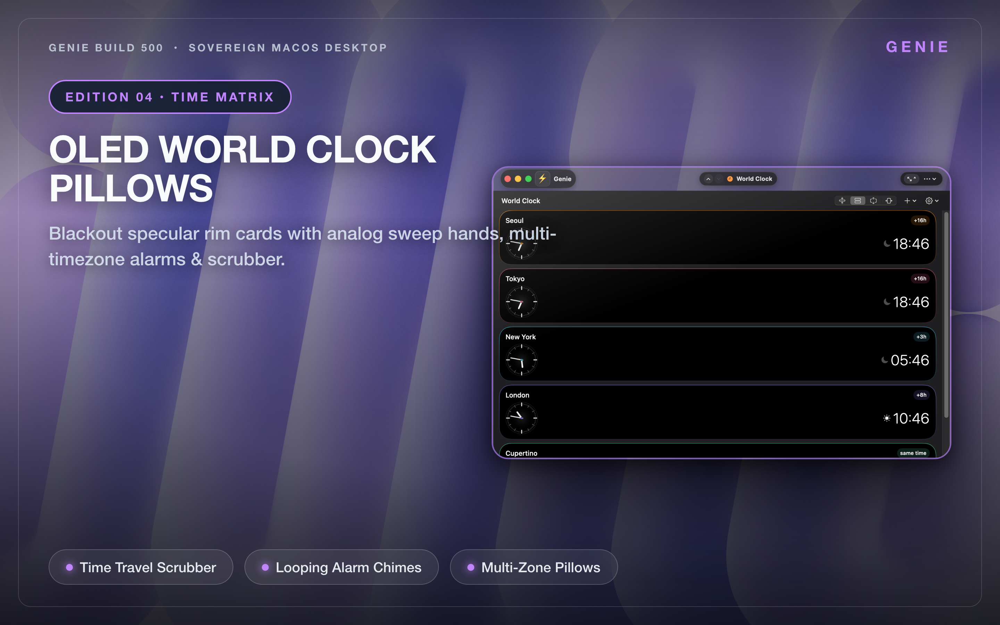
</p>

---

### 05 · Spatial Desktop Matrix
> *Summon your entire application library across an infinite 81-screen continuous universe with real spring physics.*

<p align="center">
  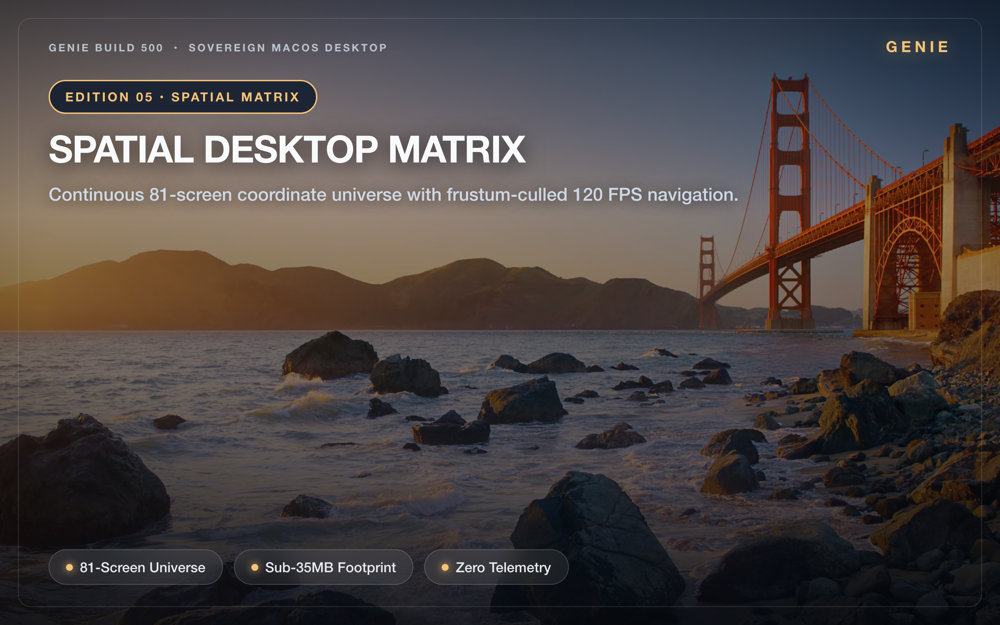
</p>

---

### 06 · System Sentinel HUD & Diagnostics
> *Real-time Mach kernel telemetry, memory pressure monitoring, and thermal auto-throttling.*

<p align="center">
  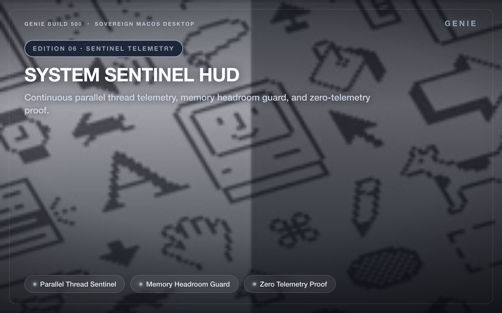
</p>

---

### 07 · Battery Telemetry & Power Gauges
> *28+ dynamic battery styles, VisionOS pill gauges, and real-time charging equalizers in your menu bar.*

<p align="center">
  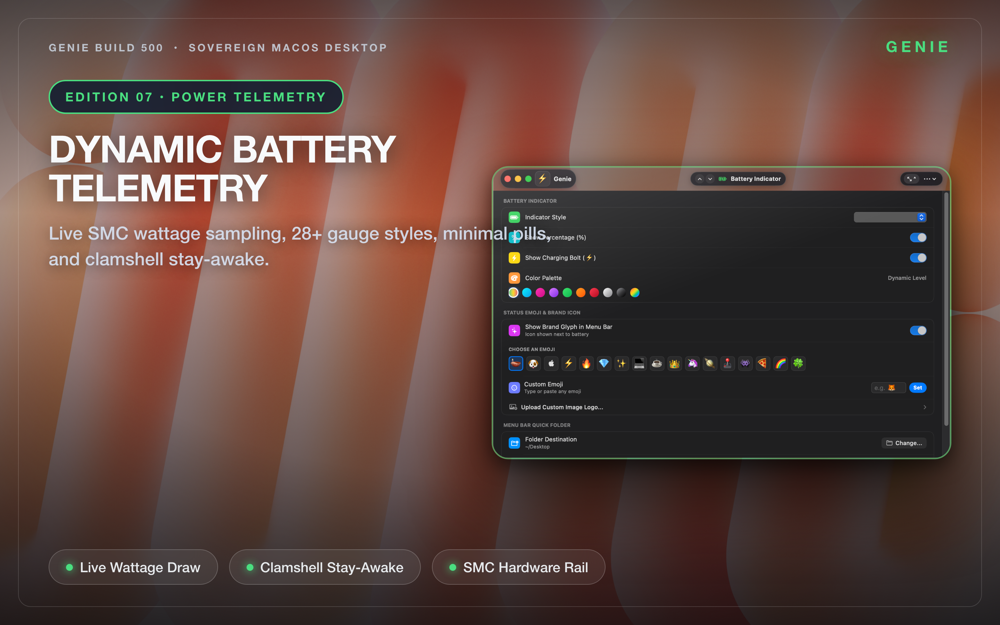
</p>

---

### 08 · Living Themes & 4K Metal Shaders
> *Hardware-accelerated fluid dynamics, caustics, and generative particle fields running at 120 FPS ProMotion.*

<p align="center">
  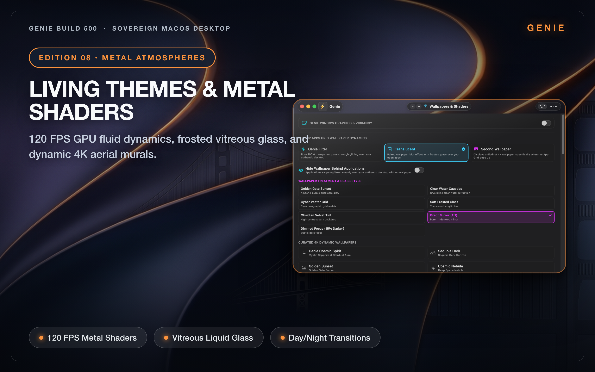
</p>

---

### 09 · Application Atelier & Formations
> *Bespoke application staging, Fibonacci Golden Spirals, Floating Lotus arrays, and lightning-fast search indexing.*

<p align="center">
  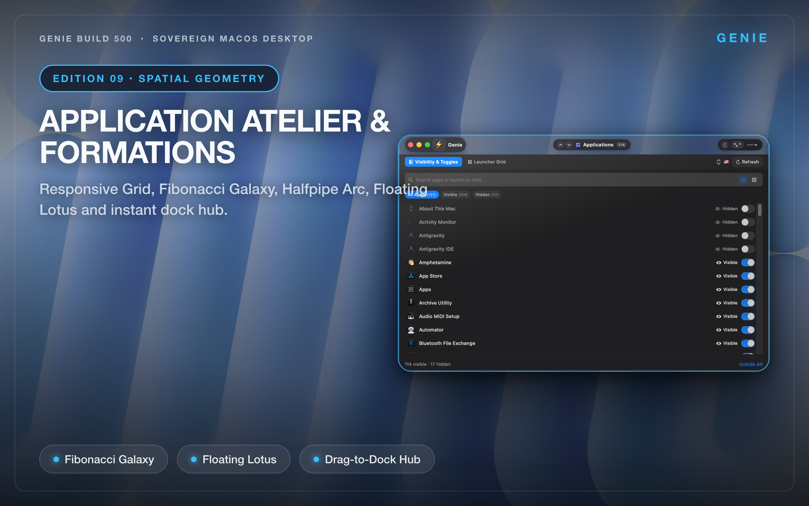
</p>

---

### 10 · Security Governance & Strict Sandbox
> *Zero analytics, verified local sandboxing, hardened runtime boundaries, and byte-level diff auditing.*

<p align="center">
  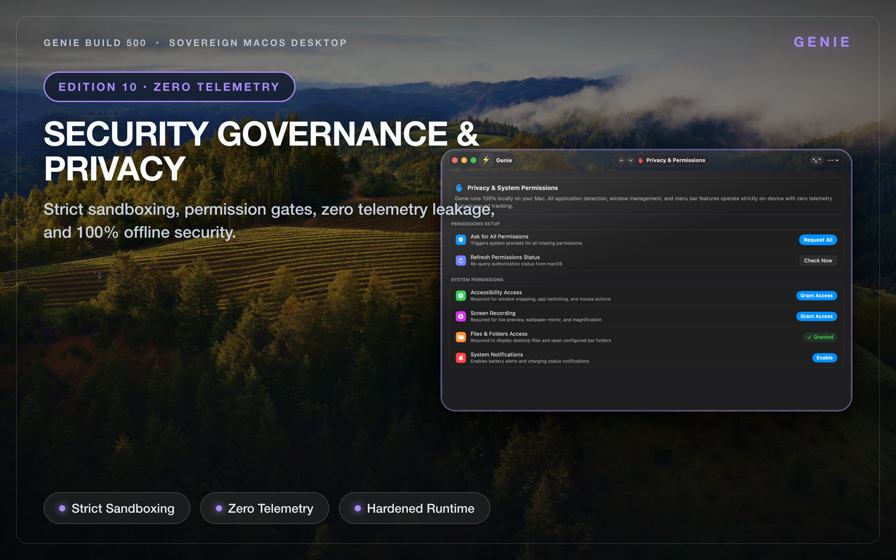
</p>

---

## 🛠️ Building & Verifying Fresh from Source

### Prerequisites
- macOS 14.0 (Sonoma) or macOS 15.0+ (Sequoia)
- Xcode 16+ or Command Line Tools (Apple Silicon toolchain)
- Swift 6.4

### Quick Build
```bash
# Clone the repository
git clone https://github.com/nicholasdudek/geniedesktop.git
cd geniedesktop

# Compile native binary with debug configuration
swift build -c debug

# Run the 10-point subsystem smoke test suite
./.build/out/Products/Debug/Genie --smoke-test
```

### Python Verification Suites
```bash
# Run dock and navigation tests
pytest tests/test_docks_and_navigation.py

# Run full smoke suite
pytest tests/test_smoke_suite.py
```

---

## 📜 Architectural Constitution & Security

Genie adheres strictly to its internal architectural guidelines documented in [`CONSTITUTION.md`](CONSTITUTION.md) and [`ENGINEERING.md`](ENGINEERING.md):

* **Zero Telemetry**: No third-party network SDKs, tracking pixels, or outbound connections.
* **Atomic Pre-Execution Checkpoints**: Any modifying agent action saves an atomic rollback state prior to execution.
* **Human Approval Gates**: Mutating commands and file edits cannot proceed without explicit interactive user approval.
* **Read-Back Byte Verification**: File updates require byte-for-byte read-back verification against the intended payload before completing.

---

## 📬 Contact & Support

* **Principal Engineer & Founder**: Nicholas M. Dudek
* **Direct Engineering Support**: [nicholas.dudek@icloud.com](mailto:nicholas.dudek@icloud.com)
* **GitHub Issues**: [github.com/nicholasdudek/geniedesktop/issues](https://github.com/nicholasdudek/geniedesktop/issues)
* **Mac App Store**: [Genie on the Mac App Store](https://apps.apple.com/app/id6808165534)
* **Website**: [nicholasdudek.github.io/geniedesktop](https://nicholasdudek.github.io/geniedesktop/)

---

<p align="center">
  Copyright © 2026 Nicholas M. Dudek. All rights reserved.<br>
  <i>Apple, macOS, Mac App Store, and Apple Silicon are trademarks of Apple Inc.</i>
</p>
