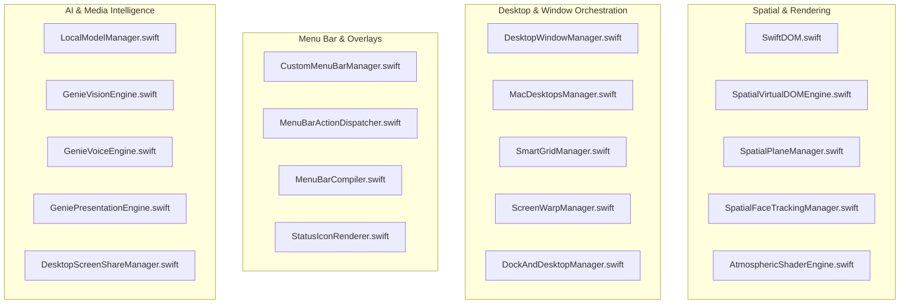

# GoldGate Helpers Directory (`Sources/GoldGate/Helpers`)

This directory contains the foundational engines, subsystem managers, hardware bridges, and performance-critical layer processors powering GoldGate and Genie.

---

## 1. Engine & Subsystem Index

---

## 2. Tokenized Classes, Subclasses & Structural Formulations

### A. Spatial & Zero-Copy DOM Rendering
* **[`SwiftDOM.swift`](file:///Users/nicholasdudek/Developer/GoldGate/Sources/GoldGate/Helpers/SwiftDOM.swift)**
  * **Tokens / Types**: `SwiftDOMTag`, `SwiftDOMStyle`, `SwiftDOMNode`, `SwiftDOMEngine`, `SwiftDOMView`
  * **Formulas**:
    $$\text{Layer Frame} = \left[x_i, y_i, w_i, h_i\right]$$
    $$\text{Parallax Plane Shift} = \mathbf{T}(dx, dy, 0) \in \mathrm{SE}(3)$$
  * **Role**: Emits lightweight CoreAnimation `CALayer` trees without triggering recursive AppKit/SwiftUI layout passes.

* **[`SpatialVirtualDOMEngine.swift`](file:///Users/nicholasdudek/Developer/GoldGate/Sources/GoldGate/Helpers/SpatialVirtualDOMEngine.swift)**
  * **Tokens / Types**: `SpatialDOMNode`, `SpatialVirtualDOMEngine`
  * **Formulas**:
    $$\text{Grid Position Index } k = 9 \cdot \text{row} + \text{col}, \quad \text{where } \text{row}, \text{col} \in [0, 8]$$
  * **Role**: Computes the 81-screen virtual universe bounding hierarchy.

* **[`SpatialPlaneManager.swift`](file:///Users/nicholasdudek/Developer/GoldGate/Sources/GoldGate/Helpers/SpatialPlaneManager.swift)**
  * **Tokens / Types**: `SpatialPlaneManager`, `PlaneCoordinates`, `Matrix3x3`
  * **Role**: High-speed camera matrix transforms for multi-workspace parallax navigation.

* **[`SpatialFaceTrackingManager.swift`](file:///Users/nicholasdudek/Developer/GoldGate/Sources/GoldGate/Helpers/SpatialFaceTrackingManager.swift)**
  * **Tokens / Types**: `SpatialFaceTrackingManager`
  * **Role**: AVFoundation + Vision face mesh landmark processor estimating real-time user gaze and face translation offsets.

* **[`AtmosphericShaderEngine.swift`](file:///Users/nicholasdudek/Developer/GoldGate/Sources/GoldGate/Helpers/AtmosphericShaderEngine.swift)**
  * **Tokens / Types**: `AtmosphericShaderEngine`, `ShaderUniforms`
  * **Formulas**:
    $$I(x, y, t) = \text{PerlinNoise}(x \cdot s_x, y \cdot s_y, t \cdot \omega) \times \text{Vibrancy}$$
  * **Role**: Metal compute shader pipelines for real-time smoke, blur diffusion, and aura backdrops.

---

### B. Menu Bar & Workspace Dispatch
* **[`CustomMenuBarManager.swift`](file:///Users/nicholasdudek/Developer/GoldGate/Sources/GoldGate/Helpers/CustomMenuBarManager.swift)**
  * **Tokens / Types**: `CustomMenuBarManager`
  * **Role**: Custom macOS status bar items, pill badges, and dropdown window lifecycle management.

* **[`MenuBarActionDispatcher.swift`](file:///Users/nicholasdudek/Developer/GoldGate/Sources/GoldGate/Helpers/MenuBarActionDispatcher.swift)**
  * **Tokens / Types**: `MenuBarActionDispatcher`, `ActionType`
  * **Role**: Centralized router for quick settings toggles, system triggers, and script invocations.

* **[`SmartGridManager.swift`](file:///Users/nicholasdudek/Developer/GoldGate/Sources/GoldGate/Helpers/SmartGridManager.swift)**
  * **Tokens / Types**: `SmartGridManager`, `GridCell`
  * **Formulas**:
    $$\text{Cell Width} = \frac{W_{\text{screen}} - (N_{\text{cols}} + 1)\cdot p}{N_{\text{cols}}}, \quad \text{Cell Height} = \frac{H_{\text{screen}} - (N_{\text{rows}} + 1)\cdot p}{N_{\text{rows}}}$$

---

### C. AI, Vision, and Local LLM Inference
* **[`LocalModelManager.swift`](file:///Users/nicholasdudek/Developer/GoldGate/Sources/GoldGate/Helpers/LocalModelManager.swift)**
  * **Tokens / Types**: `LocalModelManager`, `InferenceStreamChunk`, `ModelConfig`
  * **Role**: Orchestrates on-device MLX model loading, streaming token generation, and local prompt caching.

* **[`GenieVisionEngine.swift`](file:///Users/nicholasdudek/Developer/GoldGate/Sources/GoldGate/Helpers/GenieVisionEngine.swift)**
  * **Tokens / Types**: `GenieVisionEngine`, `OCRResult`
  * **Role**: Screen bounding box extraction and text recognition for contextual agent awareness.

* **[`GenieVoiceEngine.swift`](file:///Users/nicholasdudek/Developer/GoldGate/Sources/GoldGate/Helpers/GenieVoiceEngine.swift)**
  * **Tokens / Types**: `GenieVoiceEngine`
  * **Role**: Low-latency AVFoundation speech synthesis and microphone audio stream analysis.

---

## 3. Preservation & Development Guidelines
> [!IMPORTANT]
> **Strict Retention Rule**: When refactoring or updating code in `Helpers/`, never delete historical functions, types, or protocols. Always comment out superseded code blocks with context annotations (`// REFACTORED: ...`) to preserve historical implementation context.
