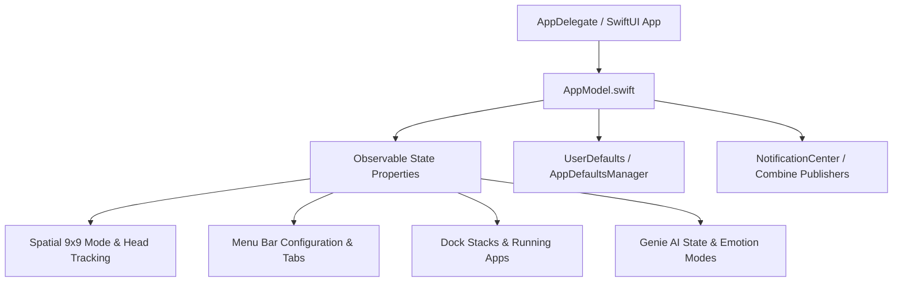

# GoldGate Models Directory (`Sources/GoldGate/Models`)

This directory maintains the centralized reactive state, user settings, persistent storage bindings, and inter-window event dispatch models.

---

## 1. Architecture & State Flow

---

## 2. Tokenized Models, Properties & Behavioral Formulas

### `AppModel.swift`
* **Tokens / Types**: `AppModel`, `AppTab`, `DropdownMode`, `SpatialPlaneMode`, `EmotionState`
* **Formulas & Enums**:
  * **Plane Mode Matrix Mapping**:
    $$\text{Screen Offset Matrix: } \mathbf{M}(r, c) = \begin{bmatrix} (c - 4) \cdot W \\ (r - 4) \cdot H \\ 0 \end{bmatrix}, \quad r,c \in [0, 8]$$
  * **Reactive Binding**: Emits `ObservableObject` / `@Published` events ensuring lockstep synchronization across floating overlays, menu bar dropdowns, and spatial canvas layers.

---

## 3. Preservation & Development Guidelines
> [!IMPORTANT]
> **Strict Retention Rule**: Never delete legacy state properties or enum cases from `AppModel`. If an enum case or property is superseded, retain it with `// REFACTORED: ...` or mark it with `@available(*, deprecated)` comments to ensure backwards compatibility with serialized configurations and UserDefaults.
