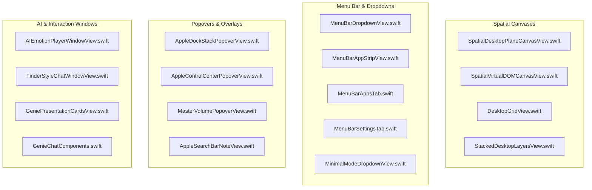

# GoldGate Views Directory (`Sources/GoldGate/Views`)

This directory houses all SwiftUI canvas layers, popover drawers, AppKit-bridged presentation windows, and interactive UI components.

---

## 1. Views Hierarchy & Categorization

---

## 2. Tokenized Views, Subviews & Spatial Layout Formulas

### A. Spatial & 9x9 Universe Canvases
* **[`SpatialDesktopPlaneCanvasView.swift`](file:///Users/nicholasdudek/Developer/GoldGate/Sources/GoldGate/Views/SpatialDesktopPlaneCanvasView.swift)**
  * **Tokens / Types**: `SpatialDesktopPlaneCanvasView`, `PlaneTileView`, `ParallaxViewportState`
  * **Coordinate Layout Formula**:
    $$X_{\text{screen}}(c) = (c - 4) \cdot (W_{\text{viewport}} + \Delta_{\text{gap}})$$
    $$Y_{\text{screen}}(r) = (r - 4) \cdot (H_{\text{viewport}} + \Delta_{\text{gap}})$$
    for $r, c \in [0, 8]$ (where $(4,4)$ is the center primary desktop).
  * **Role**: Primary interactive canvas rendering the complete 81-screen plane with smooth zoom/pan gestures and live head-tracking offsets.

* **[`SpatialVirtualDOMCanvasView.swift`](file:///Users/nicholasdudek/Developer/GoldGate/Sources/GoldGate/Views/SpatialVirtualDOMCanvasView.swift)**
  * **Tokens / Types**: `SpatialVirtualDOMCanvasView`, `VirtualDOMTilePreview`
  * **Role**: Visual debugger and live preview canvas for the CoreAnimation virtual DOM layer tree.

* **[`DesktopGridView.swift`](file:///Users/nicholasdudek/Developer/GoldGate/Sources/GoldGate/Views/DesktopGridView.swift)**
  * **Tokens / Types**: `DesktopGridView`, `DesktopThumbnailCard`
  * **Role**: Fast desktop switcher and window organization grid.

---

### B. Popover Overlays & Quick Controls
* **[`AppleDockStackPopoverView.swift`](file:///Users/nicholasdudek/Developer/GoldGate/Sources/GoldGate/Views/AppleDockStackPopoverView.swift)**
  * **Tokens / Types**: `AppleDockStackPopoverView`, `DockAppIconView`, `StackItem`
  * **Role**: Floating macOS dock enhancer featuring folder fan-out, running indicator dots, and swift actions.

* **[`AppleControlCenterPopoverView.swift`](file:///Users/nicholasdudek/Developer/GoldGate/Sources/GoldGate/Views/AppleControlCenterPopoverView.swift)**
  * **Tokens / Types**: `AppleControlCenterPopoverView`, `QuickControlSlider`, `ToggleTile`
  * **Role**: Modular quick settings popover supporting brightness, volume, Wi-Fi, Bluetooth, and spatial parallax toggles.

* **[`AppleSearchBarNoteView.swift`](file:///Users/nicholasdudek/Developer/GoldGate/Sources/GoldGate/Views/AppleSearchBarNoteView.swift)**
  * **Tokens / Types**: `AppleSearchBarNoteView`, `QuickNoteEditor`
  * **Role**: Instant spotlight-style omnibar supporting calculation, AI prompts, and desktop sticky note creation.

---

### C. AI Agent & Emotion Windows
* **[`AIEmotionPlayerWindowView.swift`](file:///Users/nicholasdudek/Developer/GoldGate/Sources/GoldGate/Views/AIEmotionPlayerWindowView.swift)**
  * **Tokens / Types**: `AIEmotionPlayerWindowView`, `EmotionParticleEmitter`, `GenieStateIndicator`
  * **Role**: Organic floating avatar communicating assistant mood, active listening, thinking state, and tool execution status.

* **[`FinderStyleChatWindowView.swift`](file:///Users/nicholasdudek/Developer/GoldGate/Sources/GoldGate/Views/FinderStyleChatWindowView.swift)**
  * **Tokens / Types**: `FinderStyleChatWindowView`, `ChatMessageRow`, `AttachmentPill`
  * **Role**: Native AppKit/SwiftUI hybrid window styled after macOS Finder for agent interaction, code preview, and task execution logs.

---

## 3. Preservation & Modification Rules
> [!IMPORTANT]
> **Strict Retention Rule**: Views must never have old controls, previews, or layout calculations deleted. Mark deprecated layouts using `// REFACTORED [Date]: <description>` and comment out the blocks to preserve the evolutionary UI design history.
