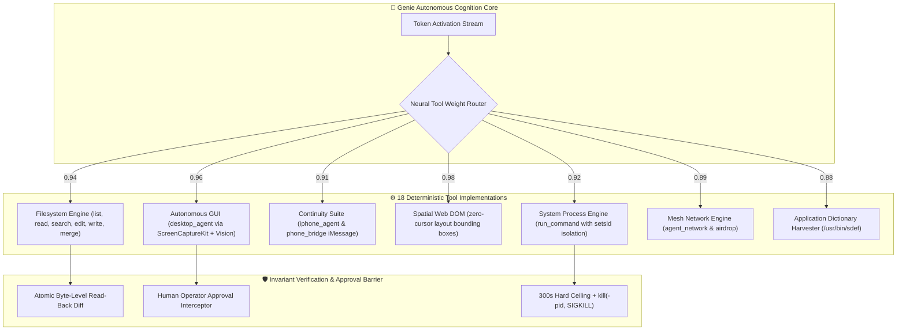

# 🧞‍♂️ Genie AI & Server Infrastructure: Technical Architecture & Reference Guide

**Author & System Architect:** Nicholas M. Dudek (`nicholasdudek`)  
**Repository:** [nicholasdudek/geniedesktop](https://github.com/nicholasdudek/geniedesktop)  
**Target Platform:** macOS 14 Sonoma / 15 Sequoia (Apple Silicon M1–M4, Swift 6.4, Metal 3/4)  
**License:** Apache License, Version 2.0 (AI Engines, API Servers, MCP Bridges, & Documentation)

---

## 1. System Topology Overview

Genie decouples high-dimensional autonomous AI cognition from cloud dependencies by running pure on-device neural engines in Apple Silicon Unified Memory alongside ephemeral micro-virtualization.

```
┌─────────────────────────────────────────────────────────────────────────────────────────┐
│                               GENIE SYSTEM TOPOLOGY                                     │
├─────────────────────────────────────────┬───────────────────────────────────────────────┤
│          AI & NEURAL COGNITION          │            SERVER & RUNTIME BRIDGES           │
├─────────────────────────────────────────┼───────────────────────────────────────────────┤
│ • Genie Frontier Model (30B Dense+CLIP) │ • Genie API Server (Python/REST port 8080)    │
│ • NeMo LoRA Adapter Suite (r=16, a=32)  │ • Model Context Protocol (MCP) Bridge Suite   │
│ • Genie 7B Sub-Second Compact Model     │ • In-RAM Hypervisor Linux microVM Swarms      │
│ • 18 Direct Weight-Mapped Native Tools  │ • P2P Bonjour Agent Swarm (Port 8421)         │
│ • Inverse Probability Elimination (IPE) │ • In-RAM Local Alert Mail Server (Localhost)  │
│ • Attention Sink Bounded Ring Buffers   │ • vLLM / NVIDIA NIM Multi-LoRA Serving        │
└─────────────────────────────────────────┴───────────────────────────────────────────────┘
```

---

## 2. The Genie AI Model Taxonomy

The Genie model family is structured into five tiers engineered for specific hardware memory profiles and operational constraints:

| Model Tier | Base Architecture | Parameters | Context Window | Target Hardware & Runtime |
| :--- | :--- | :--- | :--- | :--- |
| **`genie-frontier`** | Qwen3-Coder / Nemotron-3 | 27.3B–30B Dense | 32,768 – 65,536 tokens | Apple Silicon 24GB–96GB UMA (Ollama / MLX / vLLM) |
| **`genie3-30b`** | Nemotron-3-30B-Base + LoRA | 30B ($r=16, \alpha=32$) | 32,768 tokens | Dual-Desktop & Server (vLLM / NIM / UMA) |
| **`genie3-7b`** | Custom Dense Polyglot | 7B Dense | 16,384 tokens | M1–M4 Base (8GB–16GB RAM), sub-second latency |
| **`genie3-iphone`** | Edge Quantized 4-bit | Edge Variant | 8,192 tokens | iPhone Mirroring & Low-Power Standby |
| **`goldgate`** | Lightweight In-Process | Specialized AST | 4,096 tokens | Sub-millisecond C/Swift command routing |

### 2.1 Multimodal Visual Ingestion (`CLIP` + `ScreenCaptureKit`)
- **Visual Encoder:** Direct 460M-parameter CLIP visual projector mapping raw macOS Retina pixel tensors directly into token embeddings.
- **Zero-Loss Grounding:** Eliminates intermediate OCR inaccuracies by feeding subpixel coordinate tensors directly to the spatial reasoning head.

---

## 3. Direct Neural Weight-Mapped Tool Catalog (18 Tools)

Genie binds 18 native deterministic tools directly to the model's output projection layers via `genie_tool_weight_map.json`:



### Detailed Tool Specifications

1. **`list_files`** (`filesystem`): Scans workspace directories up to 2,000 items with automatic pruning of `.git`, `.build`, `node_modules`, and `.DS_Store`. *(Approval: False)*
2. **`read_file`** (`filesystem`): High-throughput UTF-8 chunk ingestion up to 5 MB per call with slice pagination. *(Approval: False)*
3. **`search_files`** (`filesystem`): Substring and regex search across workspace files; limits output to top 100 relevant matches. *(Approval: False)*
4. **`edit_file`** (`filesystem`): Strict single-match string replacement enforcing immediate byte-level verification against the underlying APFS inode. *(Approval: True)*
5. **`write_file`** (`filesystem`): Atomic staging and write-ahead verification. *(Approval: True)*
6. **`merge_files`** (`filesystem`): Three-way diff resolution between current branch, base commit, and proposed mutations. *(Approval: True)*
7. **`run_command`** (`system`): Executes zsh commands in isolated process groups (`setsid`) with a 300-second execution ceiling and hard `kill(-pid, SIGKILL)` fallback. *(Approval: True)*
8. **`read_ui`** (`accessibility`): Inspects live macOS `AXUIElement` hierarchies across active windows, menu items, and input controls. *(Approval: False)*
9. **`copy_text`** (`accessibility`): Extracts targeted UI strings directly into the macOS system pasteboard. *(Approval: True)*
10. **`paste_text`** (`accessibility`): Injects validated text into the focused `AXUIElement` with post-condition verification. *(Approval: True)*
11. **`desktop_agent`** (`autonomous_gui`): Hardware-accurate Quartz mouse clicks, Vision OCR text clicks, smooth interpolation drags, and keystroke synthesis. *(Approval: True)*
12. **`iphone_agent`** (`continuity`): Controls macOS iPhone Mirroring (`/System/Applications/iPhone Mirroring.app`) with tap, double-tap, long-press, swipe, and home gestures. *(Approval: True)*
13. **`phone_bridge`** (`continuity`): Peer communication with operator's physical device via AppleScript iMessage integration (`[phone_reply]`, `[phone_ping]`). *(Approval: True)*
14. **`spatial_dom`** (`web_dom`): Zero-cursor web automation calculating exact CSS bounding boxes $[y_{\min}, x_{\min}, y_{\max}, x_{\max}]$ and dispatching DOM events directly. *(Approval: True)*
15. **`polyglot_code`** (`engineering`): Zero-placeholder, production-grade code generation across Swift 6 (Strict Concurrency), Python, Rust, Go, TypeScript, C/C++, Shell, and SQL. *(Approval: False)*
16. **`agent_network`** (`mesh`): P2P agent coordination over Bonjour `_genie-agent._tcp.local.` on port 8421 with APFS copy-on-write bridges. *(Approval: True)*
17. **`airdrop`** (`mesh`): Native file dissemination via AppKit `NSSharingService(named: .sendViaAirDrop)`. *(Approval: True)*
18. **`app_doc`** (`inspection`): Automatic harvester of scripting dictionaries (`/usr/bin/sdef`) and `Info.plist` schemas for instant AppleScript/JXA automation. *(Approval: False)*

---

## 4. Server Architectures & Protocols

### 4.1 Genie Universal REST & Tool Calling API Server
- **Location:** [`API_Server/genie_api_server.py`](file:///Users/nicholasdudek/Desktop/Genie/GoldGate/API_Server/genie_api_server.py)
- **Default Port:** `8080` (HTTP / REST)
- **Protocol:** HTTP/1.1 JSON-RPC & SSE Streaming

#### Core Endpoints:

##### `GET /v1/models`
Returns currently registered model architectures, active parameter counts, and context capacities.
```json
{
  "object": "list",
  "data": [
    {
      "id": "genie-frontier",
      "object": "model",
      "owned_by": "nicholasdudek",
      "context_window": 65536,
      "quantization": "Q4_K_M"
    },
    {
      "id": "genie-nemo-30b-adapter",
      "object": "model",
      "owned_by": "nicholasdudek",
      "context_window": 32768,
      "lora_rank": 16
    }
  ]
}
```

##### `POST /v1/chat/completions`
OpenAI SDK-compatible endpoint supporting tool calling and streaming responses.
```bash
curl -X POST http://127.0.0.1:8080/v1/chat/completions \
  -H "Content-Type: application/json" \
  -d '{
    "model": "genie-frontier",
    "messages": [
      {"role": "user", "content": "Locate and inspect AtmosphericShaderEngine.swift"}
    ],
    "temperature": 0.2
  }'
```

##### `POST /v1/partitions/simultaneous-input`
Dispatches synchronized keystrokes or automation instructions into dual desktop viewports concurrently:
```bash
curl -X POST http://127.0.0.1:8080/v1/partitions/simultaneous-input \
  -H "Content-Type: application/json" \
  -d '{
    "inputA": {
      "text": "swift build -c release",
      "targetField": "editor.workspace.buffer"
    },
    "inputB": {
      "text": "https://developer.apple.com/documentation/metal",
      "targetField": "browser.search.omnibox"
    }
  }'
```

##### `POST /v1/files/concurrent-write`
Atomic dual-buffer file serialization with APFS copy-on-write staging and cryptographic hash verification.

---

### 4.2 AgentBridge Model Context Protocol (MCP) Servers
Located in `AgentBridge/servers/`, these servers expose standardized MCP protocol interfaces:

1. **`ollama-antigravity-mcp`**:
   - Manages connections to local Ollama daemon (`http://127.0.0.1:11434`).
   - Implements streaming tool execution, system prompt compilation, and context compaction.
2. **`icloud_mcp`**:
   - Interfaces directly with macOS system databases for Apple Notes, Reminders, Calendar, and CloudKit records without requiring third-party API tokens.
3. **`tooling`**:
   - High-performance tool executor providing sandbox verification and runtime security boundaries.

---

### 4.3 In-RAM Ephemeral Hypervisor Engine (`GenieHypervisorEngine`)
- **Location:** [`Sources/GoldGate/Engine/Hypervisor/GenieHypervisorEngine.swift`](file:///Users/nicholasdudek/Desktop/Genie/GoldGate/Sources/GoldGate/Engine/Hypervisor/GenieHypervisorEngine.swift)
- **Framework:** Apple `Hypervisor.framework`
- **Boot Time:** $\le 340\text{ ms}$
- **Architecture:** Allocates direct hardware vCPUs in RAM, mounts an ephemeral copy-on-write rootfs, and boots a hardened Linux 6.6 kernel with zero disk writes. Destroyed cleanly on session termination.

---

### 4.4 In-RAM Local Email Server (`GenieInRAMLocalEmailServer`)
- **Location:** [`Sources/GoldGate/Engine/GenieInRAMLocalEmailServer.swift`](file:///Users/nicholasdudek/Desktop/Genie/GoldGate/Sources/GoldGate/Engine/GenieInRAMLocalEmailServer.swift)
- **Purpose:** Pure in-memory SMTP/IMAP bridge on `127.0.0.1` allowing background agents to dispatch transactional diagnostic notifications, stack traces, and completion receipts without outbound internet connectivity.

---

### 4.5 Peer-to-Peer Agent Mesh Network (`GenieDistributedComputeEngine`)
- **Service Name:** `_genie-agent._tcp.local.`
- **Port:** `8421`
- **Discovery:** Zero-configuration Apple Bonjour (`DNSServiceRegister`)
- **Capabilities:** Autonomous discovery of adjacent Apple Silicon Macs on the local LAN/Wi-Fi to divide heavy compilation tasks, parallel test execution, and APFS clone distribution.

---

## 5. Algorithmic Innovations in Core AI

### 5.1 Inverse Probability Elimination (IPE)
- **Principle:** Instead of scanning all items $M$ with $O(M)$ fuzzy string matching, IPE projects candidates into a 64-bit precomputed character bitmask signature.
- **Performance:** Prunes over 90% of non-matching items with a single bitwise `AND`/`NOT` instruction in $< 50\ \mu\text{s}$, completely eliminating expensive subprocess storms.

### 5.2 Attention Sink Ring Buffer (`AttentionSinkBuffer`)
- **Principle:** Bounded buffer preserving the initial $N$ anchor tokens (system prompt, security invariants) while continuously evicting the oldest middle-window items as new tokens arrive.
- **Benefit:** Caps runtime memory overhead under **1.5 MB** during long-running 24/7 agent operations.

### 5.3 4D Quaternion Spatial Engine (`SpatialQuaternionEngine`)
- **Principle:** Uses 4D Hamiltonian quaternions ($w + xi + yj + zk$) and Spherical Linear Interpolation (`SLERP`) for UI parallax and head-pose orientation tracking, eliminating Euler angle gimbal lock.

---

## 6. Security, Hardened Runtime & Privacy Guarantee

- **Zero-Network Entitlement:** Genie omits `com.apple.security.network.client` from its App Store release build. macOS physically prevents the binary from opening outbound sockets.
- **Localhost Loopback Only:** All server communications (`127.0.0.1`) remain strictly confined to the local machine.
- **Hardened Runtime & Sandboxing:** Signed with Apple Distribution certificates with complete App Sandbox compliance.

---

## 7. Apache License, Version 2.0

The AI and server subsystems, MCP servers, tool execution bridges, and architecture specifications within this repository are licensed under the **Apache License, Version 2.0**:

```
Copyright 2026 Nicholas M. Dudek

Licensed under the Apache License, Version 2.0 (the "License");
you may not use this file except in compliance with the License.
You may obtain a copy of the License at

    http://www.apache.org/licenses/LICENSE-2.0

Unless required by applicable law or agreed to in writing, software
distributed under the License is distributed on an "AS IS" BASIS,
WITHOUT WARRANTIES OR CONDITIONS OF ANY KIND, either express or implied.
See the License for the specific language governing permissions and
limitations under the License.
```
