# GoldGate / Genie Full Synthesis & Master Codebase Index

## I. Executive Architectural Synthesis

GoldGate / Genie represents a native, high-performance spatial desktop environment and AI assistant built on macOS (Apple Silicon optimized with Metal, CoreAnimation, and AVFoundation).

```mermaid
graph TD
    subgraph Core App Architecture
        App[GoldGateAppMain.swift] --> Delegate[AppDelegate.swift]
        Delegate --> Model[AppModel.swift]
    end

    subgraph Spatial & Rendering Engine
        Delegate --> SPM[SpatialPlaneManager.swift]
        Delegate --> SD[SwiftDOM.swift]
        Delegate --> SVDOM[SpatialVirtualDOMEngine.swift]
        Delegate --> ASE[AtmosphericShaderEngine.swift]
        Delegate --> SFTM[SpatialFaceTrackingManager.swift]
    end

    subgraph Menu Bar & Overlays
        Delegate --> CMBM[CustomMenuBarManager.swift]
        Delegate --> DWM[DesktopWindowManager.swift]
        Delegate --> MDM[MacDesktopsManager.swift]
        Delegate --> DDM[DockAndDesktopManager.swift]
    end

    subgraph AI & Media Multimodal Pipelines
        Delegate --> LMM[LocalModelManager.swift]
        Delegate --> GVE[GenieVisionEngine.swift]
        Delegate --> GVoE[GenieVoiceEngine.swift]
        Delegate --> DSSM[DesktopScreenShareManager.swift]
    end
```

---

## II. Mathematical & Spatial Formulas

### 1. Spatial Universe Grid & 9-Desktop Macro Matrix
* **Primary Virtual Desktops**: $3 \times 3 = 9$ spatial macro screens with hardware RAM preloading.
* **Universe Matrix Topology**: $9 \times 9 = 81$ granular coordinate spaces.
* **Macro Matrix Transformation**:
  $$\begin{bmatrix} X_{\text{dest}} \\ Y_{\text{dest}} \end{bmatrix} = \begin{bmatrix} (col - 4) \cdot (W_{\text{screen}} + \text{gap}) \\ (row - 4) \cdot (H_{\text{screen}} + \text{gap}) \end{bmatrix}$$
* **Parallax Gaze Shift**:
  $$\mathbf{P}' = \mathbf{P} \times \left(1.0 + \Delta_{\text{FaceMeshOffset}} \times \text{ParallaxRatio}\right)$$

### 2. High-Speed Zero-Copy SwiftDOM Rendering
* Uses direct CoreAnimation layer transform trees (`CATransform3DMakeTranslation`), eliminating recursive AppKit/SwiftUI layout redraws during continuous camera panning and window dragging across desktop borders.

---

## III. Subsystem Directory Synthesis

### 1. Root Application
* [`GoldGateAppMain.swift`](file:///Users/nicholasdudek/Developer/GoldGate/Sources/GoldGate/GoldGateAppMain.swift): Main `@main` entry point.
* [`AppDelegate.swift`](file:///Users/nicholasdudek/Developer/GoldGate/Sources/GoldGate/AppDelegate.swift): App lifecycle, status item creation, global event dispatching, and window coordination.

### 2. Reactive State Layer (`Sources/GoldGate/Models/`)
* [`AppModel.swift`](file:///Users/nicholasdudek/Developer/GoldGate/Sources/GoldGate/Models/AppModel.swift): Centralized observable state tracking workspace tabs, spatial plane modes, and mood/emotion states.

### 3. Core Engines & Helpers (`Sources/GoldGate/Helpers/`)
* **Spatial & Layers**: `SpatialPlaneManager`, `SwiftDOM`, `SpatialVirtualDOMEngine`, `SpatialFaceTrackingManager`, `AtmosphericShaderEngine`.
* **Desktop & Window Management**: `DesktopWindowManager`, `MacDesktopsManager`, `SmartGridManager`, `ScreenWarpManager`, `DockAndDesktopManager`.
* **Menu Bar & Actions**: `CustomMenuBarManager`, `MenuBarActionDispatcher`, `MenuBarCompiler`, `StatusIconRenderer`.
* **AI & Intelligence**: `LocalModelManager`, `GenieVisionEngine`, `GenieVoiceEngine`, `GeniePresentationEngine`, `DesktopScreenShareManager`.

### 4. SwiftUI & AppKit Views (`Sources/GoldGate/Views/`)
* **Spatial Canvases**: `SpatialDesktopPlaneCanvasView`, `SpatialVirtualDOMCanvasView`, `DesktopGridView`, `StackedDesktopLayersView`.
* **Menu Bar & Dropdowns**: `MenuBarDropdownView`, `MenuBarAppStripView`, `MenuBarAppsTab`, `MenuBarSettingsTab`, `MinimalModeDropdownView`.
* **Popovers & Overlays**: `AppleDockStackPopoverView`, `AppleControlCenterPopoverView`, `MasterVolumePopoverView`, `AppleSearchBarNoteView`.
* **AI Interaction Windows**: `AIEmotionPlayerWindowView`, `FinderStyleChatWindowView`, `GeniePresentationCardsView`, `GenieChatComponents`.

---

## IV. Code Preservation Guidelines
> [!NOTE]
> All refactoring follows the **Strict Code Preservation Standard**: superseded methods and configurations are commented out with context annotations rather than deleted, guaranteeing backwards compatibility and preserving design evolution.
