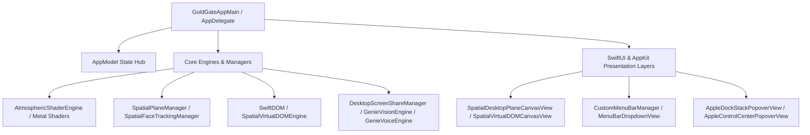

# GoldGate / Genie Architecture & Component Index

## Overview & Formulas

### 1. Spatial Desktop Plane & 9x9 Universe Matrix Formula
* **Grid Topology**: $9 \times 9 = 81$ Virtual Desktop Screens.
* **Granular Pixel Unit**: $3 \times 3 = 9$ sub-pixel sampling matrix.
* **Coordinate Mapping Formula**:
  $$\text{Target Position} = \text{Screen Coordinates} \times \left(1.0 + \Delta_{\text{FaceOffset}} \times \text{ParallaxRatio}\right)$$
* **Zero-Copy Composition**: Uses direct CoreAnimation and Metal layer transforms (`CATransform3DMakeTranslation`) bypassing recursive view re-layouts during high-frequency camera or head tracking updates.

---

## Modular Index & Class Hierarchy

---

### Core Helper Modules (`Sources/GoldGate/Helpers/`)

| Module | Core Classes / Structs | Responsibility |
| :--- | :--- | :--- |
| **`SwiftDOM.swift`** | `SwiftDOMEngine`, `SwiftDOMNode`, `SwiftDOMView` | High-performance CoreAnimation tree generator implementing dynamic DOM-like tree rendering and reactive updates. |
| **`SpatialVirtualDOMEngine.swift`** | `SpatialVirtualDOMEngine`, `SpatialDOMNode` | Virtual DOM state tree managing 9x9 plane tiles, spatial depth, and zero-latency layout calculations. |
| **`SpatialPlaneManager.swift`** | `SpatialPlaneManager`, `PlaneCoordinates` | 81-screen coordinate transform matrix calculator and dynamic camera view frustum tracking. |
| **`SpatialFaceTrackingManager.swift`** | `SpatialFaceTrackingManager` | Vision/AVFoundation camera tracker translating user head pose into real-time 3D parallax shifts. |
| **`AtmosphericShaderEngine.swift`** | `AtmosphericShaderEngine` | Metal compute and render pipelines powering smooth smoke, blur, lighting, and visual aura effects. |
| **`CustomMenuBarManager.swift`** | `CustomMenuBarManager` | Full control and dynamic rendering of custom macOS status items, menu bar overrides, and quick actions. |
| **`DesktopWindowManager.swift`** | `DesktopWindowManager` | Native AppKit floating window hierarchy, level management, and multi-monitor layout orchestration. |
| **`GenieVisionEngine.swift`** | `GenieVisionEngine` | Visual context capture and screen OCR processing pipeline for contextual assistance. |
| **`GenieVoiceEngine.swift`** | `GenieVoiceEngine` | Real-time speech synthesis and audio processing for conversational agent interaction. |
| **`LocalModelManager.swift`** | `LocalModelManager` | MLX and on-device LLM inference orchestrator with local memory cache management. |
| **`DockAndDesktopManager.swift`** | `DockAndDesktopManager` | System dock inspection, running apps status tracking, and desktop icon layering. |

---

### Views & Presentation Hierarchy (`Sources/GoldGate/Views/`)

| View File | Primary SwiftUI Views | Presentation Target |
| :--- | :--- | :--- |
| **`SpatialDesktopPlaneCanvasView.swift`** | `SpatialDesktopPlaneCanvasView` | Main 81-screen interactive canvas with fluid zoom, pan, and head-tracked perspective. |
| **`SpatialVirtualDOMCanvasView.swift`** | `SpatialVirtualDOMCanvasView` | Real-time preview canvas demonstrating Virtual DOM reactive tree changes. |
| **`DesktopGridView.swift`** | `DesktopGridView` | Mission control matrix displaying active workspaces, previews, and quick navigation. |
| **`AppleDockStackPopoverView.swift`** | `AppleDockStackPopoverView` | Quick launcher dock overlay supporting stack views and running application badges. |
| **`AppleControlCenterPopoverView.swift`** | `AppleControlCenterPopoverView` | Native-feel modular control center for brightness, volume, network, and displays. |
| **`MenuBarDropdownView.swift`** | `MenuBarDropdownView` | Deep-level customized menu bar drawer with settings, tools, and widgets. |
| **`AIEmotionPlayerWindowView.swift`** | `AIEmotionPlayerWindowView` | Interactive floating avatar and emotion engine for Genie assistant status. |
| **`FinderStyleChatWindowView.swift`** | `FinderStyleChatWindowView` | Seamless macOS Finder-styled chat window for natural language queries and workflows. |

---

### Verification & Release Instructions
1. **Compilation**: `swift build -c release`
2. **App Bundle Sync**: Copies release binary into `/Applications/Genie.app/Contents/MacOS/Genie`.
3. **Ad-Hoc Signing**: Automatically applies local codesign `codesign --force --deep --sign - /Applications/Genie.app`.
